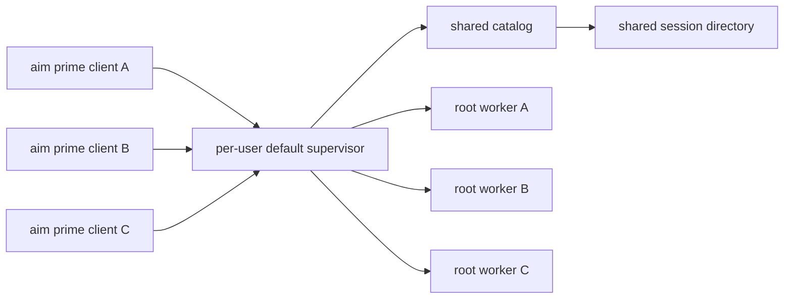
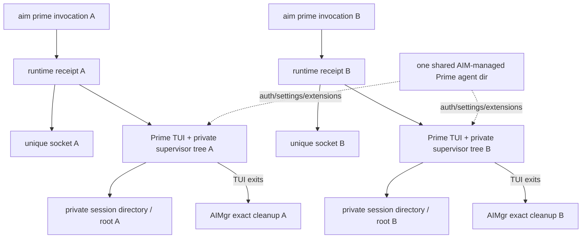
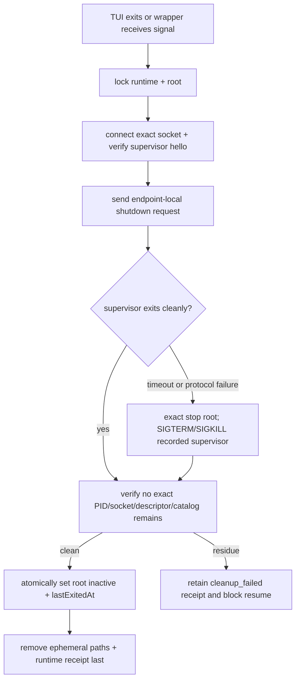

# TL;DR

- **Outcome:** `aim prime run|resume` starts one private foreground Prime runtime for that one client invocation; no active runtime shares a supervisor, catalog, socket, or session directory with another root.
- **Scope:** all fallback product changes stay in the dedicated `fallback/prime-isolated-cells` AIMgr worktree branch based on AIMgr `origin/main`; the main checkout stays untouched. Prime Agent is an unchanged external executable: no Prime source edits, development builds, unit suites, CI repair, or upstream work.
- **Cleanup:** AIMgr starts and owns the private supervisor process itself. When the TUI exits, AIMgr sends endpoint-local shutdown over that exact socket, waits for the owned process tree to end, removes runtime residue, and retains the transcript for 48 hours unless pinned.
- **Proof before install:** run focused AIMgr tests and real AIM-managed Anthropic/Fable 5.1 smoke tests through the exact worktree entrypoint and a temporary launcher/`PATH`; existing credentials remain in their normal home and no global command is rewritten.
- **Global-install gate:** implementation stops after pre-install proof. Installing globally, rewriting `PATH`, removing duplicates, rebinding services, or normalizing to one AIMgr plus one Prime installation requires a separate explicit approval. Once approved, AIMgr comes from the final pushed AIMgr `origin/main` commit and Prime must match the immutable Phase 1 pin.

This is the canonical plan only. Writing it does not implement, install, stop, uninstall, migrate, test with credentials, or delete anything.

## North Star

### Claim

> If AIMgr gives every invocation a unique private socket/runtime receipt and every logical root a private session directory, then unresponsive Prime state in one invocation cannot delay, adopt, list, or stop another invocation. We prove it live by keeping session A responsive while session B exits and is fully cleaned, then resuming B on a fresh private runtime with the same transcript.

### User-visible contract

| User action | Result |
|---|---|
| `aim prime run claude` | Starts a new Fable 5.1 root in a new private foreground runtime. |
| `aim prime resume <id>` | Starts a fresh private runtime around the retained private transcript; it never reconnects to a previous/shared daemon. |
| `aim prime import <legacy-absolute-path>` | After proving the legacy root is inactive, uses Prime's public fork path to create a new AIMgr-owned private transcript/root; the legacy JSONL remains unchanged. Normal resume rejects unmapped legacy paths and prints this command. |
| `aim prime resume <id> --rotate` | If that root is live, hand off credentials in-place through its exact private socket and return without a second attach. If inactive, fail clearly and require normal resume first. |
| Exit the Prime TUI | Ends that runtime and all of its background work/subagents, then cleans its worker/supervisor/socket residue. |
| Open two terminals | Produces two independent private runtimes; stopping or wedging one cannot mutate the other. |
| Wait more than 48 hours after exit | AIMgr deletes its own unpinned private transcript on the next bounded reconciliation. |

### Explicitly accepted losses

- Prime work does not continue after its owning TUI invocation exits.
- Heartbeats, Prime schedules, kernels, and subagents end with that invocation.
- Prime global cross-root messaging and unified agents view are not preserved.
- A second TUI cannot attach concurrently to the same root; AIMgr refuses while its runtime receipt is live.
- Prime Fleet MCP inside Prime Agent is deprecated and is not repaired or replaced.

### Hard scope guard

| Allowed | Forbidden |
|---|---|
| Edit only the AIMgr fallback worktree branch based on `origin/main`. | Edit the AIMgr main checkout or edit, commit, build for development, or fix `/Users/aelaguiz/workspace/prime-agent`. |
| Read Prime `origin/main` source/docs to verify its external contract. | Run Prime unit tests, Prime full checks, Prime CI, or chase Prime regressions. |
| Invoke the already installed canonical Prime binary as a black-box dependency. | Maintain a Prime fork or require a Prime pull request for this feature. |
| Run focused AIMgr tests and short live credential smoke tests. | Substitute passing Prime CI for the requested live behavior proof. |
| Inventory duplicate local installations and test canonicalization in a temporary `HOME`/`PATH`. | Install globally, rewrite real `PATH`, remove duplicates, rebind services, or stop existing processes before a separate explicit approval. |

### Acceptance evidence

| Evidence | Pass condition |
|---|---|
| Pre-install inventory | Read-only `type -a`, realpath, npm/package inventory, and process launcher paths identify the exact canonical keep target plus every duplicate; a temporary `HOME`/`PATH` fixture proves the one-wrapper/two-alias layout without changing the machine. |
| Live cross-cell test | Two Fable 5.1 sessions answer real prompts. B is exited/cleaned while A remains open; A answers another prompt without reconnect, PID/socket change, or connection error. |
| Cleanup inventory | Within one 20-second total cleanup deadline after TUI exit, no process, listener, worker descriptor, supervisor owner, catalog child, socket, or ephemeral runtime directory remains for that runtime ID. |
| Resume/rotate | B cold-resumes the same transcript on a fresh private socket. Separately, active A receives `aim prime resume <id> --rotate` in-place on its exact socket, changes to another eligible Anthropic account, and answers again. |
| AIMgr regression | Targeted isolation/install tests and the complete AIMgr `npm test` pass. No Prime suite is run or required. |

### Key invariants

1. **AIMgr-only implementation:** Prime is an external binary contract, not a development surface.
2. **No shared fallback:** a private runtime setup or cleanup failure fails loudly; AIMgr never retries on Prime's default socket.
3. **One client, one runtime:** each invocation owns one unique socket and a recorded process tree until exit.
4. **One logical root, one transcript home:** resume changes the runtime socket, not the private session directory or transcript identity.
5. **Exact cleanup only:** every signal/removal is authorized by runtime ID, canonical path, PID plus process-start identity, and socket/process lineage.

## Research Grounding

### Current repository state

| Item | Read-only observation on 2026-09-01 |
|---|---|
| AIMgr source | `/Users/aelaguiz/workspace/aimgr` `HEAD == origin/main == 19046783f782c18be8d4d81e9229541274aab5af`; no tracked changes. |
| Parked fallback worktree | `/Users/aelaguiz/workspace/aimgr-prime-isolation-fallback` on `fallback/prime-isolated-cells`, created from the same immutable AIMgr commit. All fallback documentation and any later fallback implementation stay here. |
| Prime source used for contract review | `/Users/aelaguiz/workspace/prime-agent` `HEAD == origin/main == 918d049add48d13dc5cdd378bb9084d07b6c4f85` at final review. Its code is identical to the externally audited `adc4c4e78d58db668e63b1ea9aa87f9a693af8fe` contract commit; the intervening change is documentation-only. Dirty generated/release artifacts are user-owned and excluded. |
| AIMgr PATH entries | `aim` and `aimgr` each currently appear at both `~/.local/bin` and `/opt/homebrew/bin`; this fails the one-install target until realpaths/package ownership are normalized. |
| Prime PATH entry | `prime-agent` appears at `/opt/homebrew/bin/prime-agent`, currently resolving through a versioned `~/.prime/installs/...` artifact; provenance must be matched to the immutable Phase 1 `PRIME_PIN`. |
| Existing docs/data | The findings report and `LIVE_HERDR_PRIME_SESSIONS_2026-09-01.json` are untracked user/work artifacts and remain untouched by implementation. |

### Prime external contract AIMgr may use

| Existing behavior | Evidence |
|---|---|
| Public `--daemon-socket <path>` selects an exact absolute supervisor path and disables cross-daemon widening for explicit resume. | Prime `args.ts:108-110`, `command-registry.ts:203-213`, `main.ts:1207-1223,1275-1285`. |
| Public `--session-dir <dir>` selects a custom session catalog/transcript directory. | Prime `args.ts:154-155`, `command-registry.ts:226-235`, `main.ts:1249-1258`. |
| Public exact stop accepts `--daemon-socket` with `stop <agent>`. | Prime `public-command.ts:90-107,163-174,437-457`. |
| Worker descriptors and worker sockets are namespaced by normalized supervisor-socket hash. | Prime `daemon-worker-cleanup.ts:215-249`. |
| Normal TUI detach leaves a resident worker running. | Prime `docs/usage.md:113`; therefore AIMgr must perform foreground teardown. |
| Public `--mode daemon --daemon-socket <absolute-path> --session-dir <absolute-dir>` runs the supervisor in the process AIMgr launches. | Prime `main.ts:1419-1442`. |
| The connected-socket protocol supports endpoint-local `shutdown`, which cleans workers, catalog, descriptors, socket, and supervisor ownership for that socket. | Prime `daemon-protocol.ts:714,900-914,1029-1033`; `daemon-supervisor.ts:2432-2434,8017-8079`. |

Public `prime-agent shutdown` and `doctor --fix` are prohibited because they discover or mutate multiple daemons. AIMgr starts the private supervisor as its own foreground child, verifies the exact socket hello, and sends the existing endpoint-local shutdown request directly. Exact root stop plus a signal to the recorded supervisor is the bounded fallback; fleet-wide cleanup is never used.

A private short `/private/tmp/aim-p-<id>` is used to contain temporary worker sockets and avoid macOS Unix-socket length failures. It is not treated as the isolation authority: Prime supervisor ownership is global and OS-wide status can still discover every listener. The explicit socket, process receipt, and endpoint-local shutdown are the authority.

### Immutable dependency pin

Phase 1 records one immutable `PRIME_PIN` commit, installed build ID, entrypoint hash, version, and protocol/schema identity before implementation begins. Every contract probe and live test uses that same tuple. A later-moving `origin/main` does not change the run. If no prebuilt canonical Prime artifact matches `PRIME_PIN`, Phase 4 blocks and reports the mismatch; it does not build, modify, or test Prime.

## Product Decisions

| Choice | Decision | Reason |
|---|---|---|
| Persistent private cell | Reject for the fast default | It requires reliable idle/background-obligation semantics that Prime does not expose publicly. |
| True no-daemon Prime mode | Do not wait for it | Prime does not expose the required interactive standalone mode; adding it violates the AIMgr-only scope. |
| Foreground private cell | Adopt | It is implementable today with existing socket/session/stop contracts and matches the accepted loss of detached work. |
| Stable socket per root | Reject | A crashed persistent socket can retain workers. A new socket per invocation gives a clean fault boundary. |
| Private full Prime agent dir | Reject initially | Shared AIM-managed auth/settings/extensions remain canonical; socket hash and private session dir provide the needed runtime/catalog isolation. |

## Current Architecture



| Current coupling | Concrete failure |
|---|---|
| All normal clients choose the same default socket. | Unrelated roots share startup, adoption, recovery, and shutdown pressure. |
| Supervisor readiness waits for its worker inventory. | Measured startup took 70.95 seconds for 14 workers while clients timed out at 30 seconds. |
| TUI exit detaches instead of stopping the worker. | Workers, catalogs, sockets, and saved sessions accumulate after terminals close. |
| One global session directory feeds every catalog. | The agents view showed 118 retained root JSONLs at the investigation snapshot. |
| Public shutdown and doctor discover multiple daemons. | They cannot be used safely to clean one isolated invocation. |

## Target Architecture

<!-- project_flow:block:target_architecture:start -->



### Two identities, not one

| Identity | Lifetime | Purpose |
|---|---|---|
| Root ID | Survives resume for up to 48 hours after exit | Owns one private session directory, transcript UUID/path, import provenance, pin state, lifecycle state, and timestamps. Provider/model/binding remain authoritative in the Prime transcript. |
| Runtime ID | One TUI invocation only | Owns one unique socket, wrapper PID, Prime TUI PID, supervisor/process receipts, socket-hash descriptor path, and cleanup state. |

Resume keeps the root ID/session directory but allocates a new runtime ID and socket. The old runtime must be proven stopped before resume can acquire the root lock.

### Filesystem contract

```text
~/.aimgr/prime-roots/<root-id>/
  root.json                      durable non-secret metadata
  sessions/                      private --session-dir; one root tree

~/.aimgr/prime-runtimes/<runtime-id>.json
                                  active/crash-recovery process receipt

/private/tmp/aim-p-<runtime-id>/
  prime-agent-<uid>/aim-<runtime-id>.sock
                                  private TMPDIR and short supervisor socket
```

The root manifest is the ownership/path source of truth. The Prime transcript inside that private directory is authoritative for provider, model, and credential binding; listing, resume, and rotation parse it under the root lock rather than duplicating mutable profile truth. The runtime receipt is temporary authority for cleanup. Listings scan these files; no index or service becomes another source of truth.

### Root manifest

```json
{
  "schemaVersion": 1,
  "rootId": "6d0135f4c812",
  "sessionDir": "/Users/aelaguiz/.aimgr/prime-roots/6d0135f4c812/sessions",
  "sessionId": "01a05...",
  "sessionPath": "/Users/aelaguiz/.aimgr/prime-roots/6d0135f4c812/sessions/01a05....jsonl",
  "cwd": "/absolute/workspace/path",
  "lifecycleState": "active",
  "importedFrom": null,
  "createdAt": "2026-09-01T00:00:00.000Z",
  "lastExitedAt": null,
  "pinned": false
}
```

### Runtime receipt

```json
{
  "schemaVersion": 1,
  "runtimeId": "b8149aef7342",
  "rootId": "6d0135f4c812",
  "state": "running",
  "tmpDir": "/private/tmp/aim-p-b8149aef7342",
  "socketPath": "/private/tmp/aim-p-b8149aef7342/prime-agent-501/aim-b8149aef7342.sock",
  "descriptorDir": "/Users/aelaguiz/.prime/agent/daemon-workers/<socket-hash>",
  "wrapper": { "pid": 1001, "processStartId": "...", "executablePath": "...", "argvHash": "..." },
  "tui": { "pid": 1002, "processStartId": "...", "executablePath": "...", "argvHash": "..." },
  "supervisor": {
    "pid": 1003,
    "processStartId": "...",
    "executablePath": "...",
    "argvHash": "...",
    "parentPidAtBirth": 1001,
    "parentProcessStartIdAtBirth": "..."
  },
  "createdAt": "2026-09-01T00:00:00.000Z",
  "cleanupStartedAt": null
}
```

The implementation may add catalog/worker receipts as discovered, but it cannot signal a PID using PID alone. Process-start identity, exact socket/runtime path, expected executable, argv, and recorded birth lineage must agree. If the wrapper later dies and the supervisor is reparented by macOS, changed current `PPID` is not itself a mismatch: cleanup is authorized only when the immutable parent PID/start identity captured at spawn and every remaining supervisor identity field still match.

### Launch sequence

1. Run bounded stale-runtime reconciliation, lock the root (or allocate a new root), and refuse if another live runtime owns it.
2. Create the private session directory, unique short socket path, and `starting` runtime receipt with owner-only permissions.
3. Spawn the canonical Prime executable as an AIMgr-owned foreground supervisor child with `--mode daemon`, the absolute private socket, absolute session directory, private `TMPDIR`, and shared agent directory.
4. Record the supervisor PID/start identity, connect to the exact socket, validate its hello/build/socket identity, then launch the interactive TUI against that already-ready socket with provider/model/resume arguments.
5. Complete existing account binding proof and wait on the TUI; regardless of normal exit, Ctrl+C, signal, or launch error, execute exact endpoint-local cleanup before AIMgr returns.

### Resume, import, and rotation rules

| Operation | Required behavior |
|---|---|
| Normal private resume | Resolve an AIMgr root manifest, refuse any live receipt, acquire the root lock, and create a fresh runtime/socket around the same private session directory. |
| Unmapped legacy selector | Reject without mutation and print `aim prime import <legacy-absolute-path>`. |
| Explicit legacy import | Prove the source root inactive, invoke Prime's public fork behavior through an isolated temporary runtime, create a new AIMgr-owned root with `importedFrom`, and never modify or auto-delete the source JSONL. |
| Active `--rotate` | Resolve the one live receipt under the root lock, take the launch-admission lock, run the existing hidden credential handoff against that receipt's exact socket/session identity, then return without launching or attaching a second TUI. |
| Inactive `--rotate` | Fail clearly and require normal resume first; rotation never creates a runtime. |

### Exact cleanup sequence



Cleanup rules:

1. Use one 20-second total deadline: seconds 0–10 endpoint-local shutdown, 10–13 public exact-root stop, 13–16 SIGTERM, 16–18 SIGKILL, and 18–20 final residue/metadata verification. A completed earlier stage skips later escalation but does not extend the deadline.
2. At every stage, validate the exact socket plus the recorded PID/start identity, executable, argv, and birth lineage; never use public fleet-wide shutdown, kill by name, or PID alone.
3. Remove runtime paths only after all recorded processes are dead and every socket/path identity still matches; never manually erase a live Prime descriptor.
4. After clean verification, atomically set the root to `inactive` with `lastExitedAt`, then remove ephemeral paths and delete the runtime receipt last. A crash between those writes leaves enough authority for reconciliation to finish safely.
5. If proof is incomplete or the deadline expires, atomically retain a `cleanup_failed` receipt, print exact residue, and block root reuse; the next `aim prime` command retries only that runtime.

Lifecycle transitions are explicit: a root moves `inactive -> launching -> active -> inactive`; a runtime moves `starting -> ready -> running -> cleaning -> removed`, with `cleanup_failed` as the only retained failure state. Root and receipt mutations occur under the same root/runtime locks. Reconciliation treats an inactive root plus a leftover `cleaning` receipt as an interrupted final write and removes that receipt only after re-verifying zero residue.

### Crash reconciliation

Every `aim prime` command performs a bounded scan of AIMgr-owned runtime receipts:

| Receipt state | Action |
|---|---|
| Wrapper still exact-live | Leave it alone. |
| Wrapper dead, private process receipts exact-live | Accept macOS reparenting only when recorded birth lineage plus current PID/start identity, executable, argv, and socket all match; then apply the same 20-second exact-cleanup contract. |
| All processes dead, paths match | Remove exact socket/descriptor/runtime residue and close the receipt. |
| Root inactive, `cleaning` receipt remains | Re-verify zero process/path residue, then delete the interrupted-finalization receipt. |
| PID/path identity ambiguous | Retain and report; never signal or delete an unproven target. |
| Cleanup pass exceeds 3 seconds | Continue the requested healthy launch if unrelated; leave remaining receipts for explicit `aim prime gc`. |

This keeps startup fast while preventing old private cells from accumulating.

### Transcript retention

| State | Policy |
|---|---|
| Active runtime | Never delete. |
| Cleanly exited, under 48 hours | Keep for normal resume. |
| Cleanly exited, over 48 hours, unpinned | Delete exact AIMgr-owned root directory after root/runtime locks and no-live-receipt proof. |
| Pinned | Keep transcript, but no daemon/process stays alive. |
| Legacy Prime global session | Never delete or mutate automatically; only explicit `import` creates a separate private fork. |

Retention runs after runtime reconciliation. A resume and purge contend on the same root lock, so only one can win. The 48-hour policy covers new roots and explicit private imports; source legacy/global transcripts remain external and are never auto-deleted.

### Prime Fleet MCP deprecation boundary

Prime Agent private cells will not receive or depend on the Prime Fleet MCP. The implementation removes/deprecates only its Prime Agent registration/injection and related AIMgr assumptions. AIMgr's general `aim mcp serve` and MCP registrations used by Codex or Claude remain untouched; the user explicitly wants those preserved.

<!-- project_flow:block:target_architecture:end -->

## Installation Normalization

### Definition of one installation

| Product | Canonical result |
|---|---|
| AIMgr | One repo checkout at the final AIMgr `origin/main` commit, one dependency tree, one canonical Node-pinning wrapper at `~/.local/libexec/aimgr`, and `aim` plus `aimgr` symlinks resolving to that same wrapper. |
| Prime Agent | One globally callable `prime-agent` package/artifact whose version/build/hash provenance matches `PRIME_PIN`; no competing PATH entry or package-manager copy. |

This requirement concerns installed code. During the live isolation test, multiple Prime processes are expected—one private process tree per open session—and must all come from that one installed executable.

### Inventory before mutation

Record a machine-readable before/after receipt covering:

1. `type -a`/`which -a`, symlink chains, and final realpaths for `aim`, `aimgr`, and `prime-agent`.
2. Homebrew, global npm prefixes, `~/.local/bin`, `~/.prime/installs`, launchd definitions, and workspace wrappers that can put those commands on PATH.
3. Package/build hashes plus every absolute AIMgr reference in Prime credential descriptors, LaunchAgent plists, watcher state, and active process argv.
4. Shell aliases/functions/hash entries that could mask the canonical commands.
5. Prime Fleet MCP registration in Prime versus Codex/Claude, so only Prime's registration is removed.

### Canonicalization policy

- Change `scripts/install-local-bin.sh` to atomically create one wrapper at `~/.local/libexec/aimgr` that execs the pinned Node binary plus the reviewed repo's `bin/aimgr.js`; atomically point both `~/.local/bin/aim` and `aimgr` symlinks to it.
- Remove competing AIMgr package copies/wrappers only after their realpaths and package ownership are recorded; do not delete the repo, config, credentials, or local state. `/opt/homebrew/bin/aim*` must not remain as competing commands.
- Prime keeps one canonical global executable and its one resolved versioned artifact. Competing package copies, symlinks, and inactive `~/.prime/installs` versions are removed only after package ownership, hashes, and process use are recorded.
- If a noncanonical Prime artifact still has a live process, stop that exact recorded process/session before removing its artifact; never use fleet-wide shutdown or kill by name.
- Clear shell command hashes and prove a fresh login shell resolves the same realpaths. Inventory alone is read-only; removal occurs only in the approved canonicalization phase.

### Installation acceptance

```text
type -a aim          -> one path
type -a aimgr        -> one path
realpath(aim) == realpath(aimgr) == ~/.local/libexec/aimgr
canonical wrapper exec target == final AIMgr origin/main/bin/aimgr.js
type -a prime-agent  -> one path
prime-agent version/build/hash == immutable PRIME_PIN receipt
all new process argv/executable paths originate from those canonical entries
```

## Call-Site Audit

| File/area | Current behavior | Planned AIMgr-only change |
|---|---|---|
| `src/cli/main.js:18`, `src/cli/commands/prime.js:3` | Routes Prime commands into the shared harness handler. | Keep dispatch; add local instance/status/gc/pin routing without another daemon. |
| `src/cli/commands/harness-target.js:422-457` | Prime launcher uses blocking `spawnSync`, inherited stdio, no private runtime, no cleanup. | Replace Prime-only use with an async foreground runner that allocates a runtime, forwards signals, waits, and cleans in `finally`; other harnesses remain unchanged. |
| `harness-target.js:517-560` | Resume launches once; rotate performs handoff then attach without an AIMgr runtime boundary. | Resolve the private root first. Resume gets a fresh runtime. Rotation targets the exact live root runtime and does not create a second persistent client. |
| `harness-target.js:562-597` | Run selects an account then launches only provider/model. | Allocate root/runtime before launch and pass exact socket/session directory while preserving account-selection proof. |
| `src/targets/prime-launcher.js:6-32` | Resolves the first PATH launcher and rejects `--dist`; preparation is pure. | Keep pure resolution but require one-install provenance and compose private args through the runtime runner. |
| `src/targets/prime-sessions.js:9-54,142-217` | Resolves one ambient session directory and reads model/binding metadata. | Resolve AIMgr roots first. Legacy lookup is read-only and permitted only for explicit private import; normal resume rejects it. |
| `src/io/paths.js:58,149-155`, `src/io/json-store.js:48` | Provides AIMgr paths, shared Prime agent dir, and atomic JSON helpers. | Add root/runtime paths, canonical path checks, owner-only atomic receipts, purge staging, and an owner-validated absolute test-local-state override. |
| `src/state/local-state.js:10`, `src/coordination/runtime.js:20-77` | Stores target ownership such as Prime `authPath` in real `~/.aimgr/local-state.json`. | Keep root/runtime records separate and plumb the guarded test-local-state override through load/write so repo-local live proof cannot persist disposable Prime paths into real state. |
| `src/targets/harness-auth.js:116-123,185-213` | Persists an absolute AIMgr helper path and owns only a short auth-file mutation lock. | Rebind descriptors to the canonical wrapper/entrypoint and add a separate launch-admission lock that survives through transcript binding proof. |
| `scripts/install-local-bin.sh:11-28` | Creates two independent wrapper files. | Create one canonical wrapper and two symlink aliases; add temp-HOME/PATH installer tests. |
| `scripts/sync-fleet.sh:15-47` | Pulls/installs Prime source and recreates `~/.local/bin/prime-agent` pointing at the checkout. | Stop installing/wrapping Prime source; sync AIMgr, verify the prebuilt `PRIME_PIN`, and fail closed on mismatch. |

### Routine and automation surfaces

| File/area | Current behavior | Planned change |
|---|---|---|
| `src/routines/launchd.js:73` | Launchd invokes only `aim routine run <id>`. | Keep unchanged; isolation stays internal to AIMgr. |
| `src/routines/run.js:759-837` | Pins through undocumented `PRIME_AGENT_INTERNAL_LEGACY_OWNED_WORKER_FRONTEND` with no private socket. | Remove that internal bypass. Start one AIMgr-owned private supervisor first, then run the pin and interactive resume against its same explicit socket/session directory. |
| `src/routines/run.js:903-920` | Starts interactive resume without a private socket. | Start through the foreground runtime runner with a unique socket and exact receipt. |
| `src/routines/run.js:1009-1075` | Owns routine exit/error handling. | Put runtime cleanup in the outer `finally` so every timeout/error/exit tears down only this routine cell. |
| `src/mcp/policy.js:60` | General AIMgr MCP rejects interactive Prime run/resume. | Leave unchanged; Prime Fleet MCP deprecation does not remove `aim mcp serve` used by Codex/Claude. |
| `scripts/install-auth-maintainer.sh`, `scripts/install-mcp-server.sh`, `scripts/lib/watch-install.sh` | Installed services embed absolute repo/Node entrypoints. | Reinstall/rebind each AIM-owned service to the one canonical AIMgr checkout and prove no plist points at removed code. |

### Test and contract surfaces

| File/area | Planned proof/change |
|---|---|
| `src/cli/args.js:83,340-342` | Parse `run`, private `resume`, explicit legacy `import`, lifecycle commands, and active-only `--rotate`; preserve zero-ceremony isolated defaults with no required passthrough flags. |
| `src/cli/help.js:51`, `README.md:120` | State foreground semantics, 48-hour retention, one-client rule, exact cleanup, and active-only in-place rotate. |
| `test/pi/prime-target.test.js:311,346,663,748,796` | Assert run/resume/import/rotate private argv, legacy rejection, active-only handoff without a second attach, runtime grouping, test-local-state isolation, admission lock, and no fallback. |
| `test/targets/prime-launcher.test.js:8` | Assert canonical executable provenance and prohibit source/dist or duplicate resolution. |
| `test/routines/routine-run.test.js:410,452,476,491,514` | Assert pin/private session behavior and exact cleanup on every routine outcome. |
| `test/cli/readme-contract.test.js:57` | Keep command/help/README semantics synchronized. |

### Account-selection boundary

Private sockets do not prevent two launches from racing through the shared AIM-managed Prime auth projection. The current auth-file mutation lock ends too early, so add one AIMgr-wide `~/.aimgr/locks/prime-launch-admission.lock` used by CLI run and routine pin:

1. Select the account and update the shared non-secret external descriptor.
2. Launch on the private runtime and wait until the authoritative Prime transcript records the expected provider, model, and binding fingerprint.
3. Release the lock immediately after proof; never hold it for the TUI lifetime.
4. On failure, clean the runtime before release and prevent a second launch from capturing the wrong binding.
5. Test run-versus-run and run-versus-routine concurrency with distinct expected labels; both transcripts must capture their own intended fingerprint.

### Prime Fleet MCP deprecation

Inventory the Prime Agent MCP registry/config and any AIMgr injection naming Prime Fleet MCP. Before the global-install gate, implement and test only detection/removal logic against fixtures; do not mutate the real registry. Separately approved Phase 5 removes only the Prime-facing registration. Codex/Claude registrations, `src/mcp`, `aim mcp serve`, and unrelated user MCP configuration remain untouched.

## Phase Plan

### Phase 1 — preflight and one-install target (20–30 minutes)

**Objective:** freeze exact inputs and removal targets before code or live runtime changes.

1. Fetch AIMgr and prove the fallback worktree branch starts at the selected immutable AIMgr `origin/main` commit; preserve the main checkout, its untracked artifacts, and unrelated user state.
2. Save complete AIMgr/Prime PATH, package, realpath, version/build, launch-service, active-process, and Prime-facing MCP inventory under `docs/evidence/`.
3. Select the one canonical AIMgr entrypoint and one canonical Prime artifact; list every duplicate wrapper/package to remove after tests.
4. Run only black-box Prime contract checks such as `--version` and `--help`; do not build Prime or run Prime tests/checks/CI.
5. Confirm the live credential labels/models needed for final smoke without exporting or printing secrets.

**Exit:** the receipt names exact keep/remove paths and proves the installed Prime exposes socket, session-dir, exact stop, Fable 5.1, and expected build identity. No duplicate is removed yet.

### Phase 2 — implement foreground isolation in AIMgr (3–5 hours)

**Objective:** make private foreground ownership the default for all AIMgr Prime launches.

1. Add ownership-only root manifests, authoritative transcript profile parsing, runtime schemas, safe paths, per-root locks, atomic receipts, process identity helpers, reconciliation, exact cleanup, 48-hour retention, and the owner-validated absolute test-local-state override.
2. Add the async Prime foreground runner: start/own the supervisor child, wait for exact-socket hello, launch the TUI, forward signals, send endpoint-local shutdown, fall back to exact stop/signal, and verify residue.
3. Wire new run, private resume, explicit legacy import/fork, live in-place rotation, and private selector resolution through that runner with no shared fallback.
4. Remove the routine's internal process-owned bypass; run pin plus interactive resume on one AIMgr-owned private supervisor/socket under the same global launch-admission lock and outer cleanup.
5. Add lifecycle commands/docs plus one-wrapper/two-symlink installer logic, descriptor/service rebinding logic, and `sync-fleet.sh` drift prevention; implement Prime Fleet MCP detection/removal against fixtures only. Do not run installers or mutate the real MCP registry in this phase.

**Constraint:** no tracked file outside `/Users/aelaguiz/workspace/aimgr-prime-isolation-fallback` changes. The AIMgr main checkout and Prime checkout remain byte-for-byte untouched.

**Exit:** a source search finds no AIMgr Prime or routine path capable of launching without explicit private socket/session identity.

### Phase 3 — AIMgr tests only (1–2 hours)

**Objective:** prove lifecycle and races quickly without turning this into Prime development.

1. Add unit tests for ownership-only manifests, transcript-authoritative profile reads after handoff, canonical paths, PID reuse, reparented-child birth lineage, exact process identity, the 20-second cleanup escalation budget, crash between root-close and receipt deletion, locks, and 48-hour purge.
2. Update `test/pi/prime-target.test.js` for isolated run/resume/import/rotate argv, unmapped-legacy rejection, import source immutability, active rotation with no second attach, run-vs-run admission, live-runtime refusal, and no shared fallback; add a run-vs-routine lock race fixture.
3. Update `test/routines/routine-run.test.js` for private session allocation and cleanup on every exit/error path.
4. Add fixture process tests plus temporary local-state/Prime-agent/PATH and temp-HOME installer/sync tests proving no real state write, one wrapper, two aliases, duplicate Prime rejection, and no stale descriptor/plist entrypoint.
5. Run targeted AIMgr tests, `npm run lint`, then full AIMgr `npm test`; never invoke Prime's test runner, build checks, or CI.

```bash
cd /Users/aelaguiz/workspace/aimgr-prime-isolation-fallback
node --test test/pi/prime-target.test.js test/targets/prime-launcher.test.js test/routines/routine-run.test.js
node --test test/install/canonical-install.test.js test/install/sync-fleet.test.js
npm run lint
npm test
```

**Exit:** all AIMgr checks pass; fixtures leave no runtime residue and never signal a sentinel process with a reused PID.

### Phase 4 — repo-local live-credential acceptance (30–60 minutes)

**Objective:** prove the fallback with real credentials without installing it globally or changing command resolution.

1. Commit only the reviewed fallback files on `fallback/prime-isolated-cells`; do not merge or push to `origin/main` as part of this fallback run.
2. Create a disposable launcher directory whose `aim`/`aimgr` aliases execute the fallback worktree's pinned Node plus `bin/aimgr.js`; prepend it only inside the test terminals and prove the real login-shell `PATH` remains unchanged.
3. Set the new owner-validated test-local-state override to a disposable file and `PRIME_AGENT_CODING_AGENT_DIR` to a disposable test agent directory; seed only required non-secret settings/extensions. The generated descriptor may point at the fallback helper while the helper reads existing AIM-managed credentials from the normal user home. Snapshot and verify both real `~/.aimgr/local-state.json` and `~/.prime/agent/auth.json` byte-for-byte before/after; never mint, export, print, or copy secrets.
4. Invoke the already installed `PRIME_PIN` artifact as a black-box dependency and run the Fable 5.1 isolation, cleanup, resume, in-place rotation, plus manual routine-worker smoke below; exact-clean only recorded test runtimes.
5. After every test process is proven dead, remove the disposable launcher/Prime agent directory and save worktree commit, process, socket, descriptor, transcript, model, non-secret account-label, and cleanup receipts; exclude secrets and full responses.

**Exit:** repo-local live behavior passes, no private runtime residue remains, and global `aim`, `aimgr`, `prime-agent`, package inventory, services, real AIMgr local state, real Prime auth descriptor, MCP registry, and `PATH` are unchanged.

If AIMgr `origin/main` moves before Phase 5 approval, rebase the fallback branch onto the new immutable base, rerun all of Phases 3 and 4 against the resulting exact commit, and issue a new evidence report. Any code or base change invalidates prior live proof.

### Mandatory stop — no global installation

Stop here and report the evidence. Do not install globally, merge/push to `origin/main`, rewrite real `PATH`, remove any package/symlink, rebind credentials or services, change Prime MCP registration, or stop unrelated processes. Phase 5 requires a new explicit user approval after reviewing Phase 4.

### Phase 5 — separately approved global canonicalization (30–60 minutes)

**Objective:** only after explicit approval, leave one installed AIMgr and one installed Prime artifact.

1. Require approval naming the exact Phase 4-proven candidate SHA and its unchanged `origin/main` base; if either differs, return to the Phase 4 refresh rule before any push or install.
2. Fast-forward `origin/main` to that exact proven SHA, then install it as one wrapper/two aliases; atomically rebind AIM Prime credential descriptors and AIM-owned LaunchAgents/watchers before removing old AIMgr entrypoints.
3. Normalize Prime to the one recorded prebuilt artifact matching `PRIME_PIN`; remove only recorded competing copies/symlinks, never `~/.prime` history/config, and never build or test Prime.
4. Remove/deprecate Prime Fleet MCP from Prime Agent only, while proving Codex/Claude keep intended MCP access.
5. Repeat the short concurrent isolation/cleanup smoke through canonical commands and save before/after installation receipts.

**Exit:** one canonical AIMgr installation, one canonical Prime installation, post-install behavior passes, and no private runtime residue remains.

## Live-Credential Acceptance Script

### Preconditions

- Use the disposable test-terminal `aim` alias pointing at the fallback worktree and the read-only inventoried `PRIME_PIN`; do not alter login-shell command resolution.
- Use existing AIM-managed Anthropic subscription credentials through disposable AIMgr local state plus the disposable Prime agent directory; do not mint, export, print, or copy tokens, and verify real `~/.aimgr/local-state.json` plus `~/.prime/agent/auth.json` are byte-identical before/after.
- Confirm two eligible Claude labels exist before testing rotation; if only one is eligible, record that exact external blocker rather than fabricating a pass.
- Use two disposable working directories with no valuable uncommitted files because Prime retains normal tool authority.
- Keep prompts deterministic and tiny to minimize time and provider usage.

### Live test A — concurrent isolation

1. In terminal A, run `aim prime run claude`; send `Reply exactly: CELL_A_OK. Do not use tools.` and verify Fable 5.1 plus the selected AIM label.
2. In terminal B, run `aim prime run claude`; send `Reply exactly: CELL_B_OK. Do not use tools.` and verify a different runtime ID, socket, descriptor namespace, and private session directory.
3. Leave A open. Exit B through the ordinary TUI exit path that users actually use; start the single 20-second total cleanup timer.
4. Verify B has no live receipt/process/listener/socket/descriptor/catalog residue, then send A `Reply exactly: CELL_A_STILL_OK. Do not use tools.`
5. Pass only if A answers without reconnecting, changing socket/supervisor identity, or reporting `Connection error`.

### Live test B — in-place rotation

1. While A remains live, run `aim prime resume <A-session-id> --rotate` from another terminal; it must hand off A in-place through its runtime receipt/exact socket, print that the existing TUI should continue, and avoid a second attach or shared daemon.
2. Verify the handoff receipt changes to a different eligible Anthropic label and retains `anthropic/claude-fable-5-1`.
3. In A, send `Reply exactly: CELL_A_ROTATED_OK. Do not use tools.`
4. Pass only if the response succeeds with the new label and the same root/session/runtime identities.

### Live test C — cold resume and final cleanup

1. Exit A and verify its runtime residue clears within the single 20-second total cleanup deadline.
2. Resume B by its canonical session UUID using `aim prime resume <uuid>`; verify a new runtime ID/socket but the same root ID, private session directory, transcript, provider/model, and prior `CELL_B_OK` history.
3. Send `Reply exactly: CELL_B_RESUMED_OK. Do not use tools.` and verify a real Fable 5.1 response.
4. Exit B again; run `aim prime instances --json` and process/socket/descriptor inventory.
5. Pass only if no test runtime remains and both retained roots are eligible for the documented 48-hour policy.

### Live test D — routine smoke

Use one minimal temporary AIMgr routine with a prompt that replies exactly `ROUTINE_CELL_OK` and no tool calls. Run its repo-local worker entrypoint manually against temporary routine configuration; do not invoke the installer/bootstrap path and do not create, load, unload, or remove a LaunchAgent. Prove its pin and interactive phases use the private root/runtime model, remove only its temporary config/prompt, and verify the Prime cell is gone after the worker exits.

## Verification Matrix

| Failure injected | Expected AIMgr behavior |
|---|---|
| Supervisor never becomes ready | Abort that launch, terminate the recorded child, retain diagnostic receipt only if cleanup cannot prove completion. |
| Prime TUI exits nonzero | Run exact shutdown anyway, return original exit code after cleanup, and preserve transcript if one was created. |
| Exact socket shutdown hangs | Stay inside the 20-second total budget: exact-stop the known root, SIGTERM then SIGKILL only the recorded supervisor identity, and verify residue. |
| AIMgr receives Ctrl+C/SIGTERM | Forward once to TUI, wait briefly, perform cleanup, then exit with matching signal semantics. |
| AIMgr is SIGKILLed/machine restarts | Next `aim prime` command reconciles dead wrapper receipts and removes or terminates only exact recorded cell state. |
| PID is reused or path identity changes | Refuse signal/delete, mark `cleanup_failed`, and print exact evidence. Never guess. |
| Another runtime is healthy | Cleanup and fault injection for the target runtime leave its process, socket, transcript, and stream unchanged. |
| Session reaches 48 hours | Purge only an unpinned AIMgr-owned root with no live runtime receipt or session lease. |

## Rollback

1. Stop creating new private runtimes while preserving all root manifests and transcripts.
2. Cleanly exit or exact-clean active private test runtimes using their recorded sockets; do not invoke fleet-wide Prime shutdown.
3. Restore the previous single AIMgr artifact only after recording the private-root resume paths.
4. Do not translate private roots back into the shared global catalog automatically.
5. Prime installation and source stay unchanged unless separately approved Phase 5 removed a proven duplicate; restore that duplicate solely from its recorded package-manager receipt if canonical resolution fails.

Rollback fails closed. It does not silently use Prime's default socket.

## Risks and Controls

| Risk | Control |
|---|---|
| Prime endpoint protocol changes | Verify hello/build before sending exact shutdown; fall back only to exact root stop plus the supervisor PID AIMgr itself launched. |
| Background work is cut off | This is intentional foreground semantics and is stated in help before rollout. |
| Shared auth projection races | Hold existing admission lock through transcript binding proof, then release immediately. |
| Runtime cleanup targets wrong PID | Require process-start identity, exact socket/runtime path, executable, and lineage before every signal. |
| Live credential smoke changes account selection | Record non-secret before/after labels; use explicit live rotation authorized by this plan; never expose tokens. |

## Effort

| Work | Estimate |
|---|---:|
| Preflight and install inventory | 20–30 minutes |
| AIMgr implementation | 3–5 hours |
| AIMgr-only tests | 1–2 hours |
| Repo-local live proof | 30–60 minutes |
| Separately approved global normalization | 30–60 minutes |

Target before the mandatory install stop: approximately 5–8 hours. Separately approved global normalization adds 30–60 minutes. There is no multi-day Prime CI or soak gate.

## Mandatory Pre-Install Stop Definition

1. Fallback implementation and commits exist only on `fallback/prime-isolated-cells`; the AIMgr main checkout and Prime tracked files remain unchanged.
2. Focused and full AIMgr tests pass; no Prime build, test suite, CI, or source change occurred.
3. All four repo-local live-credential tests pass with Fable 5.1 and leave no test runtime residue.
4. Read-only inventory still shows the same global commands/packages/services as before Phase 1.
5. Execution stops and reports evidence before any global install, merge/push to `origin/main`, `PATH` rewrite, duplicate removal, service rebinding, or Prime MCP mutation.

## Full Completion Definition After Separate Approval

1. AIMgr tracked changes are based on AIMgr `origin/main`; Prime tracked files remain unchanged.
2. `aim`/`aimgr` resolve to one AIMgr installation and `prime-agent` resolves to one Prime installation.
3. Every AIMgr Prime launch uses a unique private runtime socket and private root session directory with no shared fallback.
4. Exit/crash cleanup is exact and 48-hour retention applies only to AIMgr-owned unpinned roots.
5. AIMgr tests and all four live-credential acceptance tests pass with Fable 5.1, and no test runtime residue remains.

The full plan becomes complete only after a later implementation audit matches these claims to current AIMgr code, installation receipts, and fresh live evidence. Approval to implement through Phase 4 does not authorize Phase 5.
