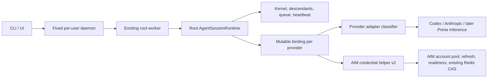

# AI Manager × Prime Agent architecture panel

## Pinned implementation worktrees

**Implementation worklog:** `docs/AI_MANAGER_PRIME_AGENT_ARCHITECTURE_IMPLEMENTATION_WORKLOG_2026-08-10.md`

**Current gate:** Phases 0–3 remain **OVERBUILD-FREE CERTIFIED**, but the 2026-08-11 staggered-exhaustion incident and a real persisted Codex `usage_limit_reached` fixture reopen one bounded continuity repair. Section 13 supersedes the earlier whole-tree-idle recovery contract: manual handoff must work while descendants remain active, using request credential generations rather than a tree drain or active-call counter. The same bounded implementation may include the exact Codex classifier and single-flight automatic retry capability, but automatic cross-account use must remain disabled for any credential pool whose applicable provider agreement does not permit it. Claude remains manual until an equivalent exact pre-output exhaustion fixture exists. No daemon-topology, per-child credential, broker, watcher, persistent migration, or generic retry work is authorized.

**Recovery identity, 2026-08-11 — IMPLEMENTED AND INSTALLED:** the full canonical Prime session UUID now appears as a dedicated second row in AIM's existing managed `title · account · branch · cwd` identity widget. The AIM-only presentation change is installed locally and on `home` staging. It added no Prime protocol/core change, disconnect state, persistence, registry, lock, daemon, or background worker. Section 12 contains the panel decision, exact scope, proof, and installation receipt.

| Environment | Project | Implementation worktree | Branch | Pinned base |
|---|---|---|---|---|
| Local | AI Manager | `/Users/aelaguiz/workspace/aimgr-prime-session-handoff-20260810` | `feature/prime-session-handoff-20260810` | AIM `main` at `98f8f40df647806835163d698556e7fcc59e9446` |
| Local | Prime Agent | `/Users/aelaguiz/workspace/prime-agent-session-handoff-20260810` | `aimgr-session-handoff-20260810` | freshly fetched `upstream/main` at `d1b072686d6b7b1b7d2ad773541e33aba1f578d9` |
| `home` staging | AI Manager | `/home/aelaguiz/workspace/aimgr-prime-session-handoff-20260810` | `staging/prime-session-handoff-20260811` | AIM `main` at `98f8f40df647806835163d698556e7fcc59e9446` |
| `home` staging | Prime Agent | `/home/aelaguiz/workspace/prime-agent-session-handoff-20260810` | `staging/prime-session-handoff-20260811` | bundled local `upstream/main` base at `d1b072686d6b7b1b7d2ad773541e33aba1f578d9` |

All implementation for this plan belongs in these two worktrees. The original AIM and Prime worktrees retain pre-existing untracked/dirty analysis and routing state and are not implementation roots for this effort.

**Date:** 2026-08-10

**Scope:** AI Manager, the Prime Agent fork, current upstream Prime Agent, credential rotation, live-session continuity, daemon and worker lifecycle, locking, the upstream → fork → source → dist → runtime dependency chain, and the code/test/doc overbuild that should be removed

**Mode:** Phase-gated implementation is active. The panel must audit and certify the actual diff and freeze the next scope at every boundary.

> **Pinned-upstream correction:** Current upstream `d1b07268…` uses one fixed per-user daemon socket and does not scope daemon compatibility by build identity. Earlier descriptions of existing build-scoped daemons refer to the inspected fork, not the pinned upstream implementation base. Phase 1 adds only truthful existing-`buildId` fences; daemon topology and resident routing remain unopened Phase 2 decisions.

## Decision in one sentence

Keep pinned upstream's single fixed per-user daemon unless current evidence proves concurrent builds are necessary, stop treating credentials as immutable session identity, switch a live root's provider binding only between requests through AIM, and require every launcher/supervisor/worker to attest the code it actually executes.

That is the smallest architecture that preserves the same session, worker, kernel, descendants, queue, and attach path through a credential change without creating credential-scoped daemons, a daemon resolver or registry, a worker-migration system, a background broker, or a quota state machine.

The phase-gated implementation has corrected one premise from the initial analysis: build-scoped sockets existed in the inspected fork, not in the pinned upstream base. Truthful build fencing is now complete. Build-scoped sockets and cross-daemon routing stay rejected unless a currently live non-default owner or repeated real busy-build conflict proves that deliberate concurrent-version residency is required.

The quota-driven fork is the wrong abstraction. Prime's ordinary fork feature is still useful for intentional conversation branching; `resume --rotate` should no longer create a fork.

The follow-up cruft verdict is **`cruft-found`**. Recent integration windows added roughly 4,530 test lines against roughly 5,226 runtime lines, but much of that test surface protects fork/reset rotation, permanent binding immutability, retired migration states, and mock seams that cannot catch the reproduced composition failures. The replacement is not a new testing system: it is five permanent behavioral proofs, followed by deletion of the obsolete code, tests, fixtures, and live documentation.

---

## 1. Recommendation

### 1.1 The target architecture



The ownership rules are:

| Concern | Correct owner | Explicitly not the owner |
|---|---|---|
| Daemon compatibility and worker routing | Existing fixed daemon plus exact executed artifact/runtime identity | Credential label, source checkout merely adjacent to a dist bundle |
| Live root, kernel, descendants, queue, heartbeat | Existing Prime root worker/runtime | AIM, credential helper, a replacement fork |
| Current non-secret provider binding | Root `AgentSessionRuntime`, one mutable generation per provider | Daemon, global `auth.json`, each provider request independently |
| Credential pool, readiness, token refresh, alternate choice | AIM and its existing Redis-backed credential layer | Prime session journal, daemon registry |
| Meaning of a provider failure | Provider adapter | Generic core 429 handling |
| Durable session state | Existing JSONL session, with append-only non-secret binding transitions | Secrets, refresh tokens, reservation receipts |

“Per agent” should initially mean **per live root agent tree**, not per daemon and not an independent account assignment for every descendant. Descendants already belong to the root runtime. Each admitted provider request snapshots the current binding generation; an in-flight request can finish on its snapshot, while later requests use the new generation. If a stale in-flight failure arrives after another request has already changed the generation, it adopts/retries against the committed generation rather than advancing again.

This gives high concurrency without multiplying long-lived credential state. Independent descendant bindings should be reconsidered only if a real workload proves that root-level ownership blocks useful concurrency or leaks provider identity across scopes.

### 1.2 What `resume --rotate` should do

For an active session:

1. Discover the daemon that owns the selector across all compatible discovered daemons.
2. Send one capability-gated handoff request to the existing worker.
3. If output is streaming, apply the handoff before the next provider request; never interrupt or replay emitted output.
4. Persist the new non-secret binding in the same JSONL session.
5. Attach to the same active root. Do not create a new root, worker, daemon, saved session, or fork.

For an inactive saved session, acquire the existing normal session lease, resume the same JSONL, commit the transition before its next provider request, and retain the same session identity.

Automatic handoff uses the same runtime operation, but only for a provider-classified, account-scoped rejection that occurred before any model output and after the provider's ordinary bounded transient retry policy. It retries the provider request at most once after the handoff.

### 1.3 What remains unchanged

- Prime daemons remain scoped to compatible executable builds/artifacts. Different incompatible builds may coexist.
- AIM remains the only authority for credential pool membership, readiness, secret resolution, refresh, and Redis CAS publication.
- Same-binding 401/403 refresh remains the first response to an expired or rejected token.
- Ordinary Prime fork remains available for intentional branching and inherits the latest binding.
- Explicit `--daemon-socket` remains an exact operator override.

### 1.4 The implementation order, when implementation is authorized

1. **Clean current-upstream base and truthful execution identity:** preserve the uncommitted attach work, replay only necessary fork patches onto current upstream, quarantine the stale dist, make lanes explicit, and compute identity from the selected runtime closure.
2. **Resident routing and truthful dead state:** land one stateless resolver used by list/attach/stop/send/rename; classify exact-dead descriptors without adding a registry or janitor.
3. **Manual same-session handoff:** add helper protocol v2, root-owned binding generations, follower wait/reload/adopt, and append-only transitions; fund only the five proofs in §7.1.
4. **Codex automatic handoff:** enable one pre-output transition/retry only after the composed proof and policy approval. Anthropic and future Prime Inference remain manual until exact fixtures justify an adapter.
5. **Subtraction and cutover:** delete quota fork/reset behavior, permanent v1 compatibility, obsolete immutable-binding and migration tests, stale docs/fixtures, and rebuilt-artifact ambiguity; run the full existing CI once before landing.

The first two slices remove current flakiness independently of credential rotation. The third makes the fork workaround unnecessary. The fifth is a required deliverable, not optional cleanup after the feature ships.

---

## 2. Evidence boundary

| Boundary | Status | What it means |
|---|---|---|
| **Reproduction status** | **Reproduced:** source/dist identity contradiction; AIM lane misclassification; dead-descriptor status behavior. **Source-proven:** quota rotation forks because binding transition is forbidden. **Historically reproduced:** live cross-daemon attach failure. **Not attempted:** live credential handoff and real provider quota mutation, because they do not exist and the review was read-only. | The local machine proves multiple important causes, but it does not prove the incidence rate of live orphan workers or that every provider quota response is safely replayable. |
| **Evidence lanes** | Consulted: current source, ignored/generated artifacts, local processes and descriptors, git history and live upstream refs, focused tests, internal design/bug records, and official provider documentation. Unavailable: production Fly logs, BigQuery, Sentry, PostHog/replays, and device/simulator logs. | There is no production denominator or revenue telemetry. The recommendation is based on direct causal evidence and falsifiable composition tests, not invented fleet frequency or dollar impact. |
| Facts measured now | AIM HEAD, Prime branch/dirty state, daemon descriptors, process identities, bundle contents/hashes, Node/npm/dependencies, current upstream refs, focused tests. | These claims describe the inspected workstation and repositories on 2026-08-10. |
| Source-proven behavior | Credential immutability, fork/reset rotation, helper v1 exact resolution, auth-file locking, build-ID propagation, status/reap classification, provider retry/output boundaries. | These are implementation facts even where a live failure was not recreated. |
| History evidence | Attach bug record, rotate-repeat bug, stale-descriptor bug, broker design, checkpoint/revert sequence. | History shows recurrence and previous overbuild, but is not substituted for present source. |
| Hypotheses | Exact rate of simultaneous account collision; exact Anthropic managed-OAuth quota payload; whether every Codex account-bound transport is reset correctly; business frequency. | These must remain behind proof or policy gates. |

### 2.1 Current repository and runtime state

| Surface | Measured state |
|---|---|
| AIM | `main` at `98f8f40df647806835163d698556e7fcc59e9446`; only pre-existing untracked `.antigravitycli/`, `.firecrawl/`, and `.tmp/` were present. The initially referenced `4cae0450…` object is not in the local repository. |
| Prime fork | Branch `aimgr-credential-broker` at `a199147dbd2d7ff010f5072802375a132468ee81`; pre-existing modified changelog, `main.ts`, routing test, and untracked cross-daemon bug document were left untouched. |
| Official upstream | Live `upstream/main` resolved to [`d1b072686d6b7b1b7d2ad773541e33aba1f578d9`](https://github.com/PrimeIntellect-ai/prime-agent/commit/d1b072686d6b7b1b7d2ad773541e33aba1f578d9). Latest release was [`v0.7.1`](https://github.com/PrimeIntellect-ai/prime-agent/releases/tag/v0.7.1); current main was seven commits newer than that release at inspection time. The cached local `upstream/main` was stale. |
| Toolchain | Node `26.6.0`, npm `11.18.0`, darwin/arm64. `npm ls --depth=0` reported no dependency problem in either repository. Prime permits Node `>=22.8`; AIM permits Node `>=20`; neither pins one tested Node line. |
| Daemon status | `./prime-agent.sh status --json` reported five `unreachable` daemon rows, all five with `hasTrackedWorkers`, and one marked default. No reported descriptor PID existed or matched its recorded process-start identity. This is stale metadata, not five living daemons. |
| Descriptor inventory | 28 scope/journal directories, 19 supervisor configs, 37 worker descriptors, and 37 recovery journals across five supervisor paths. Thirty-five workers were stop-tombstoned; two were not. No matching live process or Unix socket was present. |

The user-visible complaint is therefore a mix of at least three different phenomena that the current UI collapses together:

1. dead descriptors presented as daemons with tracked workers;
2. historically live workers on a non-default build-scoped daemon that default-only attach could not find; and
3. extra/misidentified daemon scopes caused by executing one artifact while reporting another identity.

It is not accurate to conclude from the present status output that five active Prime daemons are currently consuming work. It is accurate to say the lifecycle/status model makes dead state look active and can preserve records that ordinary repair refuses to classify as safe cleanup.

### 2.2 Credential rotation is currently a fork workaround

The current chain is explicit in source:

```text
quota or operator requests rotate
  → AIM selects an alternate account
  → AIM mutates shared auth.json under a global file lock
  → AIM launches Prime with --fork --reset-credential-binding
  → Prime clones saved history into a new root and removes the selected binding
  → helper resolves the new root's exact immutable binding
```

The relevant facts are:

- AIM's `handleResume` in `src/cli/commands/harness-target.js` selects/mutates the target and invokes `--fork --reset-credential-binding`.
- `docs/aelaguiz/AIM_PRIME_ROTATE_RESUME_2026-08-06.md` explicitly accepts losing the live kernel, descendants, pending queue, heartbeat, worker identity, and root identity.
- Prime's `external-credential-client.ts` supports only `operation: "resolve"` for the exact requested tuple.
- Prime's `auth-storage.ts` freezes descriptor changes inside an active root, while `session-manager.ts` rejects a second binding and can drop one only in the cloned fork.
- Prime's current external-auth retry handles structured pre-output 401/403 refresh of the same binding; it cannot advance to a different binding.

The fork machinery is not intrinsically broken. Its use as quota failover is broken. The model accidentally made credential identity part of permanent conversation identity, then used conversation branching to escape that constraint.

### 2.3 The global AIM lock is on the wrong hot path

`src/targets/harness-auth.js` wraps shared `auth.json` mutation in `proper-lockfile` with ten exponential retries from 100 ms up to 10 seconds. The nominal retry delays total approximately 42.7 seconds before randomization. That can approach or exceed the helper's overall time budget.

The file lock is appropriate for rare installation/uninstallation or explicit default configuration changes. It is not appropriate for per-session quota handoff. In the target architecture, a live handoff neither edits global `auth.json` nor changes the default account for new roots, so that lock leaves the steady-state path entirely.

A separate high-concurrency issue exists in the Redis refresh path. The current focused test for 50 simultaneous due resolves proves one refresh winner and 49 `lease_busy` failures. The single refresher is correct for refresh-token integrity; immediately failing all followers is not. The lean correction is:

```text
one caller acquires provider/label refresh lease and publishes a new generation
followers bounded-wait, reload, and adopt the winner's generation
if a handoff candidate is busy, selection tries the next bounded candidate
```

This requires no new distributed lock, watcher, background process, or receipt protocol.

### 2.4 Daemons are build-scoped, not credential-scoped

The default socket includes the runtime build ID. A supervisor owns public routing and workers; one worker owns one root runtime. Multiple accounts can legitimately be used by different roots under one compatible supervisor. Credentials therefore belong below the daemon boundary.

The historical cross-daemon failure was narrower: a live worker remained on a non-default daemon after the default build changed, while attach queried only the default daemon. Resume correctly refused to duplicate the leased session but did not route attach to its owner, leaving a real background worker inaccessible from the normal command path.

The current uncommitted Prime patch is directionally correct. It discovers existing daemons, resolves a known selector to an owner, and routes attach to that socket while preserving explicit-socket semantics. This should become a small stateless resolver shared by list, attach, stop, send, and rename. Discovery already exists; no persistent daemon registry is needed.

Status and repair need a similarly narrow correction:

- `reachable`: socket probe and compatible supervisor identity succeed;
- `hung/unreachable`: a matching live process exists but the socket does not answer;
- `dead-descriptor-only`: no exact PID/process-start identity exists;
- `recoverable`: an explicitly eligible, compatible non-tombstoned record;
- `safe-cleanup`: exact-dead artifacts with no live owner.

Current status treats descriptor presence as `hasTrackedWorkers` without validating liveness. Reap then skips unreachable PID-less rows that have tracked descriptors, so `doctor --fix` cannot clean the five rows seen in this review. Read-only status should never delete; an explicit doctor repair can remove exact-dead artifacts. No janitor daemon is warranted.

The two non-tombstoned descriptors deserve special handling: a stale supervisor must not silently resurrect them unless artifact/protocol identity is compatible and recovery eligibility is explicit. Otherwise it should quarantine/report them.

### 2.5 The newly reproduced execution-identity breach

The most concrete new finding is not credentials. It is that Prime can execute an old ignored dist bundle while claiming today's dirty source identity.

Current behavior:

1. `prime-agent.sh` computes and exports `PRIME_AGENT_BUILD_ID` from the current checkout before parsing `--dist`.
2. The dist branch executes the ignored bundle with that source-derived environment value.
3. runtime identity gives the environment ID precedence over the bundle's embedded ID.
4. the supervisor may recompute source identity for a worker whenever a launcher path is present.
5. AIM calls a daemon “dist” only when its build ID starts with `dist-`; a dist daemon carrying a `beta-...dirty` source ID is called source.
6. a later AIM launch can remove `--dist` and execute different code while treating it as reuse of the same lane.

The direct read-only reproduction was:

```text
node packages/coding-agent/dist/bundle/cli.js status --json
  → five rows, zero marked default under the bundle's embedded identity

./prime-agent.sh --dist status --json
  → the same five rows, one marked default under today's source-derived identity
```

The current source identity was `beta-11-ga199147d-dirty.33ab58e3ef00dfb4`. The ignored 39-file bundle embedded `beta-8-g191b3b13-dirty.c721f10b3c02cbc4`, was generated from an intermediate dirty ops worktree, and contains abandoned operations and `PRIME_AGENT_LAUNCHER_LANE` code absent from current source. Current source reports daemon protocol 7/schema 13; that bundle reports protocol 7/schema 16. The eventual checkpoint reported schema 19; live upstream reports schema 14. The bundle is neither current source, the eventual checkpoint, nor current upstream.

This creates both failure directions:

- the same unchanged artifact can acquire a new daemon identity whenever nearby source changes, multiplying scopes;
- different executable code can share a source-like identity, defeating the compatibility fence.

The source lane is also hybrid rather than pure TypeScript: the coding-agent entry runs through `tsx`, but workspace packages export compiled `dist/index.js`. A source checkout fingerprint alone therefore does not prove that all loaded workspace JavaScript is fresh.

### 2.6 Dependency-chain consistency: identity, not forced sameness

The correct chain is:

```text
selected official upstream SHA
  → minimal fork patch stack
  → dirty/clean source input graph
  → built workspace package outputs
  → runnable bundle/assets/runtime files
  → external node_modules closure
  → Node ABI + platform + architecture
  → explicit launcher lane
  → daemon identity
  → worker identity
  → versioned AIM helper capability
```

“Consistent” should not mean that every layer must equal the current checkout. A deliberately selected installed release or explicit dist artifact may be older than nearby source. It means that every process tells the truth about which immutable executable closure it is using, and incompatible closures cannot share a daemon.

The smallest provenance mechanism is a runtime-computed execution digest, not a generated manifest or environment manager:

```text
source executionId = H("source\0" + exact source/imported-workspace-output closure)

dist executionId = H("dist\0" + sorted runtime paths and bytes
                          + resolved external dependency identities
                          + Node ABI/platform/architecture/protocol)

installed executionId = H("installed\0" + the same installed runtime closure)
```

The hashed runtime closure is only what can affect the selected lane: bundle chunks; imported compiled workspace outputs; shipped Prime runtime, skill, theme, asset, and export files; resolved external packages such as `zeromq`, `koffi`, `undici`, Photon, and clipboard integration; and the runtime compatibility tuple. Official upstream SHA, fork SHA, dirty state, package version, and build time remain useful diagnostics, but they are not compatibility identity unless they change the executable closure.

The launcher computes the ID once after it has selected the actual lane and entrypoint, then passes that immutable claim launcher → supervisor → worker. An inherited/environment ID is an expected fence that may be compared and rejected; it is never authority and never overrides the computed closure. A dist or installed worker never consults an adjacent source checkout or recomputes a source identity.

AIM passes its configured lane explicitly and consumes additive structured status fields such as `{lane, executionId, entrypoint, daemonProtocol, schema}`. It does not infer a lane from an ID prefix or silently add/remove `--dist`. Missing fields mean that the resident daemon does not support the new operation; one capability mismatch fails visibly rather than starting a second daemon or guessing compatibility.

Changed or missing runtime files, incompatible resolved dependencies, unsupported ABI, or protocol/helper mismatch fail before session open/recovery. Nearby source drift does not invalidate an explicitly selected dist/installed artifact. If hashing the actual closure later proves measurably too slow or the closure cannot be enumerated safely, a build-generated manifest becomes an evidence-backed optimization; it is not part of the initial architecture.

For environment consistency, select one upstream-supported Node LTS major and one npm version during the rebase, pin the same pair in both repositories' existing metadata/CI, and use `npm ci`. This is a small dependency-chain contract, not a version-manager service, monorepo migration, lockfile attestation system, or build registry. The current dependency trees resolve successfully; no present package-resolution failure was proven.

### 2.7 Current upstream should be the integration base

Do not extend the current dirty branch in place. Preserve the uncommitted attach work, create a clean integration worktree from live upstream `d1b07268…`, then replay only the minimal required fork patches and rebuild the artifact from that exact state.

Live upstream is materially relevant: it includes release 0.7.1 and newer worker lifecycle/recovery/attach telemetry changes, but it does not implement hot credential handoff. Updating upstream reduces the lifecycle delta; it does not remove the need for the architecture above.

The stale ignored bundle must never be carried forward as an implementation base. Rebuild it only after selecting and testing the upstream/fork integration state.

### 2.8 Provider behavior and policy are adapter-specific

Core Prime must not treat arbitrary 429s as authorization to change accounts.

| Failure | Same-binding action | Cross-binding action | Replay rule |
|---|---|---|---|
| Expired/rejected token, structured 401/403 | Refresh exact binding | None initially | Existing pre-output retry only |
| Temporary provider throttle with `Retry-After` | Bounded wait/jitter | No | Honor provider policy and total retry budget |
| Structured account/plan exhaustion | None after normal retry | Eligible only when policy permits and an alternate is ready | Once, and only before output |
| Provider overload/5xx/network ambiguity | Ordinary bounded transient handling | No | Never reinterpret as account exhaustion |
| Billing/permanent/invalid request | Surface exact error | No | No replay |
| Any error after model output | Surface/continue normal stream error behavior | No immediate handoff | Never replay emitted work; optional handoff applies before the next request |

Codex is the best first automatic proof because the adapter already sees structured `usage_limit_reached`, `usage_not_included`, and `rate_limit_exceeded` codes and reset/plan information. Its cached WebSocket is keyed by session ID and discarded on failure; a handoff must explicitly dispose account-bound transport and avoid carrying a previous-response handle across accounts, then retry with full context on a new connection.

Anthropic creates an HTTP client from the per-request token, but its documentation notes that SSE can report errors after the initial HTTP 200. The exact managed-OAuth account-quota payload has not been captured here. Claude therefore gets manual same-session switching and existing exact-binding refresh first; automatic quota handoff remains disabled until real pre-output fixtures distinguish account exhaustion from ordinary rate limiting and overload.

Future Prime Inference support should require only a provider adapter classifier and AIM pool metadata. If “PI” refers to the existing Pi-style harness rather than Prime Inference, the same provider-neutral runtime/helper boundary still applies. Neither interpretation requires putting credentials into daemon identity.

There is also a policy boundary. Current [OpenAI consumer terms](https://openai.com/policies/terms-of-use/) prohibit circumventing rate limits or restrictions, and current [Anthropic consumer terms](https://www.anthropic.com/legal/consumer-terms) restrict account sharing, automated non-API access, and bypassing protective measures. This is not legal advice, but it is enough to require a product gate: seamless automatic cross-account rotation must be **off by default for consumer-plan exhaustion** and enabled only for an approved commercial/organizational credential pool whose contract permits it. Same-principal refresh remains ordinary behavior. Manual handoff can preserve a session, but it must not silently replay ambiguous or already-emitted work.

---

## 3. Options and tradeoffs

| Option | What it fixes | Cost and new failure domains | Reversibility | Verdict |
|---|---|---|---|---|
| Do nothing | Nothing causal; preserves current code | Continued fork proliferation, misleading dead-state inventory, lock contention, lane drift, inaccessible resident workers | Complete | Rejected for a high-concurrency operator |
| Provenance + routing only | Stops artifact impersonation and makes resident workers discoverable | Small runtime-digest/status/resolver surface; quota still requires a fork | High | Safe interim milestone, not the full answer |
| Root-runtime handoff + provenance + routing | Preserves one live session through approved quota changes and fixes the proven daemon/artifact causes | One helper capability, one root generation/single-flight per provider, append-only journal transition, adapter classifiers | High at behavior level; old-binary downgrade needs explicit proof | **Recommended** |
| Independent descendant credentials + atomic account claims | Potentially spreads one tree over more accounts | More mutable states, inheritance rules, collision/claim recovery, harder mental model | Medium | Defer until measured root-level contention requires it |
| Credential-scoped daemons or one global daemon | Appears to centralize account switching | Couples unrelated identities, multiplies daemons by account or requires incompatible build migration | Low | Reject |
| Broker daemon, global registry, durable reservations, worker adoption | Centralizes every concern | New services, locks, receipts, reconciliation, recovery, stale-state cleanup, and more unreachable work | Low | Reject |

The key tradeoff is intentional: the recommended design does not guarantee exclusive account allocation to every concurrent root. AIM can use an opaque root salt as a deterministic tie-break among equally ranked eligible accounts and exclude the current binding. If measured collisions remain harmful, a short bounded selection claim can be considered. A durable reservation/session registry is not justified now.

---

## 4. Panel read

### Revenue/operator perspective

The valuable outcome is completion of the user's current turn in the same attached work context. A fork that copies transcript text but loses the live runtime is not continuity. There is no trustworthy revenue denominator, so the panel does not manufacture dollar impact. The practical priority is: provenance and attach repair as independent reliability fixes, then a one-working-day feasibility spike for same-session manual/Codex handoff before a broader roadmap.

### Product journey perspective

The success contract is observable: the same root/saved session, worker runtime, kernel state, descendants, queue, heartbeat, and normal attach selector remain usable. The operator should not need to understand which daemon owns the worker or create a second conversation because one credential exhausted. List, attach, stop, send, and rename should share one stateless resolver across discovered daemons.

### Lean architecture perspective

Keep the current build-scoped topology. Fix the identity input and resident routing rather than collapsing daemons. A root-owned mutable binding is the smallest unit that matches existing runtime ownership. Do not add a broker, registry, environment manager, background janitor, reservation ledger, or live-worker transfer.

### Product engineering perspective and resolved disagreement

Engineering agreed on in-place handoff, helper protocol versioning, append-before-publish persistence, provider-specific classifiers, and provenance-first sequencing. It proposed independent descendant bindings, short atomic Redis account claims, a full generated artifact manifest, and a 50-helper-process concurrency proof. The panel did not adopt them: no measured evidence defeats root ownership or deterministic root-salted selection; a digest over the selected runtime closure is sufficient initially; and 50 independent real-Redis clients test the refresh race without creating a process farm. A test-value review proposed deferring dead-state proof; the panel instead combined it with the already-required resolver proof because exact-dead descriptors were directly reproduced and are one of the reported “inaccessible instances,” without requiring another harness. All rejected expansions remain evidence-gated options, not hidden requirements.

### Upstream, environment, and policy perspective

The current ignored bundle is not a safe development level: it contains abandoned code and a different schema while impersonating source. Live upstream should be the integration base; an explicit lane and runtime-computed digest should identify the executable closure without creating another generated artifact contract. Provider semantics and consumer-plan terms prevent a generic “rotate every 429” feature. Codex can lead the proof; Claude and future Prime support should plug into the seam only after provider-specific evidence.

---

## 5. Interrogation record

### 1. Which causal claims were demonstrated, and which remain inferred?

Demonstrated locally:

- direct bundle and wrapper `--dist` execution choose different defaults because the wrapper overwrites artifact identity with source identity; the ignored bundle also contains code/schema absent from source;
- five current daemon rows are dead-descriptor state, not matching live processes;
- status calls those rows tracked and reap skips this shape;
- global auth mutation has a nominal retry schedule of approximately 42.7 seconds;
- fifty concurrent due resolves currently produce one refresh success and 49 `lease_busy` failures in the focused test.

Source-proven:

- rotate-resume mutates global configuration and forks because a live root cannot accept a second binding;
- helper v1 can resolve only the exact binding;
- provider output/retry boundaries and Codex structured error codes exist;
- AIM guesses launcher lane from build-ID prefixes;
- attach historically queried the wrong/default daemon, while the current patch routes known selectors across discovery.

Inferred and awaiting composition proof:

- that root-runtime handoff will preserve all live behavior with real Codex transport teardown;
- that root-salted selection sufficiently distributes this user's concurrent sessions;
- that Anthropic exposes a safe account-exhaustion signal for automatic handoff;
- the fleet-wide rate and business cost of these failures.

### 2. What was reproduced, attempted, or deliberately not attempted?

| Item | Classification | Evidence |
|---|---|---|
| Source/dist identity contradiction | `reproduced` | Direct bundle status returned zero default; shell `--dist` status returned one default over the same descriptor set. Embedded and exported IDs differ. |
| Dead descriptors presented as tracked unreachable daemons | `reproduced` | Five rows, 37 descriptors, zero matching PIDs/process-start identities, no sockets. |
| Cross-daemon selector/routing logic | `reproduced in focused tests`; historical live incident documented | Current uncommitted routing tests passed; no live compatible worker existed to recreate the incident without mutating daemon state. |
| In-place credential handoff | `not attempted because` | It is not implemented, and the review did not authorize credential or session mutation. |
| Real provider quota switching | `not attempted because` | No live account/quota mutation was authorized; exact Anthropic fixture is unknown. |
| Supplied AIM SHA `4cae0450…` | `attempted, unavailable` | The object is absent locally; actual current HEAD was recorded instead. |

### 3. Which standard product evidence lanes were not consulted?

- **Fly logs:** not configured or supplied for this local CLI/runtime investigation.
- **BigQuery:** no relevant product event dataset or denominator was available.
- **Sentry:** no issue stream tied to these local daemon/session IDs was available.
- **PostHog/session replays:** not applicable to the terminal daemon and helper boundary, and no events were supplied.
- **Device/simulator logs:** not applicable to this desktop CLI/runtime path.

The absence of those lanes limits frequency/impact claims, not the reproduced source/artifact defects.

### 4. Does the recommendation fix the causal owner or an adjacent symptom?

It fixes the causal owners:

- exact artifact/runtime provenance fixes false daemon identity;
- a stateless cross-daemon resolver fixes owner discovery;
- root-runtime mutable binding fixes the artificial permanent credential pin;
- helper v2 keeps account choice/refresh in AIM without global target mutation;
- adapter classification puts rate-limit meaning at its causal owner, while liveness-aware status/doctor fixes dead descriptor classification.

Collapsing daemons, lengthening the auth-file lock, adding a broker, or automatically cleaning every unreachable row would address adjacent symptoms and create new failure modes.

### 5. What other paths reproduce the same surfaces?

- Any `--dist` launch after source changes can relabel an unchanged bundle, AIM can switch lanes from that mislabeled default, and a hybrid source run can import stale workspace `dist` not represented by a pure TypeScript fingerprint.
- Every quota-driven `aim prime resume <id> --rotate` follows the fork/reset path by design.
- Any resident session on a reachable non-default daemon can fail default-only attach/list/stop routing.
- Any exact-dead worker descriptors cause status to report tracked rows and can block safe reap; non-tombstoned stale records can be recovery candidates.
- Any simultaneous due refresh for one label can expose follower `lease_busy` behavior.

These paths were grounded with repository-wide search, current source, ignored artifacts, git history, and named bug/design documents.

### 6. What is the falsifiable closure condition?

The architecture is closed only when the five bounded proofs in §7.1 jointly establish:

1. actual execution identity across launcher, supervisor, worker, and AIM;
2. cross-daemon owner routing plus truthful exact-dead classification;
3. one Redis refresh with 50 bounded followers adopting its generation;
4. one composed Codex A→B handoff that preserves the original live root and restart state; and
5. refusal of ambiguous, post-output, stale-generation, failed-helper, and incompatible-capability transitions.

Passing isolated unit tests at mocked seams is insufficient, but one mega-test is also unnecessary. Only the Codex happy path needs the real helper subprocess, session manager, provider stream wrapper, and throwaway Redis in one journey; the other four proofs use the narrowest composition boundary that can falsify their causal claim.

### 7. What observation would prove this architecture wrong or incomplete?

- Real provider quota failures occur after output/cannot be distinguished from transient throttling, or transport retains account-bound state beyond teardown; automatic replay must then be disabled, deferred, or isolated only as proven necessary.
- Root-level binding causes cross-descendant leakage or blocks required independent progress; binding ownership may need to narrow after that proof.
- Deterministic root-salted selection still produces harmful collisions under measured concurrency; a short claim can then be justified.
- An immutable artifact and source process need compatible coexistence that current build-scoped daemons cannot provide; topology can be reconsidered only with an explicit incompatible-build migration model.
- Consumer/commercial terms do not permit the intended pool behavior; automatic cross-account handoff must remain disabled regardless of technical correctness.

### 8. Which named recent regressions or same-surface issues were checked?

Neither repository contains a `REGRESSIONS.md`. The last-seven-day same-surface evidence checked was:

- AIM credential-broker integration/implementation record and rotate-resume design, including acknowledged runtime loss;
- `PRIME_ROTATE_REUSES_ACCOUNT_2026-08-09.md` on repeated alternate selection from stale telemetry;
- stale AIM descriptor/provider-switch bug record and the removal of its receipt/pending-transition machinery;
- Prime's cross-daemon attach routing bug document and current uncommitted repair;
- Prime/AIM checkpoint, broad revert, narrow restore, and current-upstream lifecycle/recovery history through `d1b07268…`, including the intermediate ignored bundle.

The causal issue joining them is that durable identity and ownership were assigned at the wrong layers: credentials were made permanent session identity, build identity described the checkout rather than the executable closure, and commands treated the default daemon as the only routing owner.

---

## 6. Smallest robust choice

### 6.1 One root credential owner with a tiny state surface

The root holds, per provider:

```text
current non-secret binding tuple
current binding generation
cached in-memory access credential
optional in-flight handoff Promise
```

There is no persistent “pending” transition and no two-phase state machine.

The durable transition order is:

```text
provider adapter emits handoff-eligible pre-output rejection
  → compare request's binding generation with root's current generation
  → coalesce one handoff for this root/provider
  → AIM helper v2 advances to a different eligible binding
  → append non-secret credential_binding transition synchronously
  → publish new in-memory generation and invalidate account-bound transport
  → retry the provider request once
```

If helper selection or journal append fails, keep the old binding and surface the original provider failure. If append succeeds and the process crashes before retry, resume folds the last transition and resolves the new binding. If the retry fails, the session remains intentionally committed to the new binding and returns one terminal diagnostic.

Older Prime readers currently fail closed when they encounter conflicting bindings. That is safer than silently selecting the wrong account, but arbitrary binary downgrade is not a permanent product requirement. Execution-status and helper capability checks must reject incompatible combinations before mutation, and the temporary compatibility code gets an explicit deletion gate.

### 6.2 Helper protocol v2, not a broker process or permanent compatibility platform

Add the smallest explicit capability/version, conceptually:

```text
aimgr-credential-v1
  resolve(exact binding) → same binding + memory-only access

aimgr-credential-v2
  resolve(exact binding) → same binding + memory-only access
  advance(provider, current tuple, expected generation, opaque root salt, normalized reason)
    → different eligible binding + memory-only access
```

AIM owns eligibility, refresh, readiness, ranking, exclusions, and policy. Prime owns the request boundary, expected generation, append, transport disposal, and retry. The session journal stores label/identity/provider metadata only—never access or refresh credentials.

During one coordinated transition, AIM may understand v1 `resolve` and v2 `resolve/advance`, while new Prime requires v2 before enabling handoff. Drain or reject stale v1 daemons/artifacts, then delete the v1 implementation and its tests after the explicit cutover condition. One table-driven capability-mismatch proof covers both directions; there is no permanent provider × protocol × source/dist compatibility matrix.

The helper stays a short-lived subprocess with bounded JSON input/output. No long-running credential broker is needed.

### 6.3 Selection without a reservation system

For the first version:

- exclude the current binding;
- rank only ready/policy-eligible bindings;
- use an opaque root salt to break ties deterministically across concurrent roots;
- skip a candidate whose refresh lease is busy and try the next bounded candidate;
- coalesce repeated failures within one root/provider by binding generation.

Measure collisions and exhausted-pool behavior. Do not add account reservations, receipts, a global allocation ledger, or reconciliation until a failing load proof demonstrates that the above is insufficient.

### 6.4 Lock discipline

- Global `auth.json` lock: installation, removal, and explicit defaults only.
- Redis refresh lease: one short lease per provider/label to preserve refresh-token correctness.
- Followers: bounded wait/reload/adopt, not immediate failure.
- Root handoff single-flight: in-memory Promise/mutex scoped to one live root/provider.
- Session persistence: existing journal append/lease; no new lock class.

### 6.5 Development-level discipline

- Track one selected official upstream commit.
- Keep the fork patch stack small and reviewable; replay it onto current upstream rather than merging the stale generated bundle.
- Make source/dist/installed explicit and never auto-switch lanes.
- Compute one execution digest from the actual selected closure; add a generated manifest only if measured launch cost or unsafe closure discovery later requires it.
- Pin one tested Node/npm build line in both repositories and existing CI; use `npm ci`.

This provides consistency without introducing a monorepo, dependency manager service, artifact registry, or environment orchestration layer.

---

## 7. Proof and decision rule

### 7.1 Required proof set

This is a hard budget of **five permanent behavioral proofs**, not five new suites, frameworks, mega-fixtures, or per-field matrices.

| Proof | Composition boundary | Required assertions |
|---|---|---|
| Execution identity composition | actual selected runtime closure + launcher + supervisor + worker + AIM status parser | The three processes report one ID; a source edit does not relabel explicit dist; one representative runtime file/dependency/ABI change changes the ID; a false inherited ID cannot override reality; AIM never guesses or flips lane. |
| Resident routing and dead state | two build-scoped test supervisors + shared resolver + descriptor liveness + status/doctor planner | A selector present only on the non-default daemon works through list/attach/stop/send/rename; explicit socket remains exact; ambiguity/query uncertainty fail visibly; exact-dead records neither count as live nor block known-owner routing, and only explicit repair plans cleanup. |
| Refresh follower fanout | real throwaway Redis lease/CAS path with 50 independent callers | Exactly one HTTP refresh and one publish occur; all 50 callers bounded-wait/reload/adopt the generation; zero callers receive the current 49-way `lease_busy` fanout. |
| Composed Codex handoff happy path | actual Prime root/session/provider wrapper + one actual AIM helper subprocess + throwaway Redis + faux structured pre-output quota | One A→B transition and one retry complete the turn; root/worker/session/kernel marker/descendant/queue/heartbeat stay identical; no fork/new daemon/global auth mutation/secret persistence; restart loads B. |
| Refusal and race table | provider classifier + binding generation + helper capability seam | Ambiguous/transient 429, after-output failure, helper failure, late old-generation failure, and old/new capability mismatch cause no replay, mutation, loop, or second transition; maximum one transition per request/generation. |

### 7.2 Provider rollout rule

Automatic handoff is enabled per provider only if all five conditions are met:

1. exact structured fixture distinguishes account/plan exhaustion from temporary/global throttling;
2. the failure is guaranteed to be before provider output at the retry seam;
3. account-bound transport can be disposed and verified under the new credential;
4. pool use is contractually/policy approved;
5. the composed proof passes under concurrent requests and restart.

Codex is the first candidate. Anthropic remains manual/exact-refresh until its fixtures pass. Future Prime Inference is another adapter, not a reason to generalize the core prematurely.

### 7.3 Decision and rollback rules

- **Proceed** from provenance/routing to manual handoff when source/dist identity is truthful across launcher/supervisor/worker and the current attach patch passes on current upstream.
- **Proceed** to Codex automatic handoff only when the composed same-session proof passes and policy approves the pool.
- **Stop** automatic replay if any output escaped, the provider classification is ambiguous, or transport ownership cannot be proven reset.
- **Add a short selection claim** only after a repeatable concurrency test shows root-salted choice causes harmful collisions.
- **Revisit descendant-level ownership** only after a test shows root-level binding prevents required independent progress.

### 7.4 Verification already completed

Focused panel runs passed 151 tests across AIM target/helper/credential paths and Prime routing/credential/session/daemon identity paths. These tests verify the current exact-binding/fork contract and the in-progress cross-daemon routing behavior; they do not count as proof of an unimplemented handoff.

The follow-up cruft audit independently ran the AIM full suite: 360 tests passed in approximately 3.38 seconds. Focused AIM and Prime audit slices also passed 40 tests in 0.71 seconds and 94 tests in 3.06 seconds respectively. This confirms that the central test problem is authoring/review/maintenance and architectural hostage-taking, not a slow focused runtime. One current AIM test deliberately expects 50 simultaneous due resolves to yield one success and 49 `lease_busy` results; that is evidence of a behavior to replace, not a concurrency contract to preserve.

Both repositories passed `git diff --check`. `npm ls --depth=0` reported no current dependency resolution problems. No daemon, credential, Redis key, git ref, remote, or service was mutated.

---

## 8. Do not build

1. **No credential-scoped daemon, one-global-daemon conversion, global daemon registry, or live-worker migration/adoption system.** Credentials and executable compatibility are different identities.
2. **No credential broker daemon, durable account reservation ledger, receipts, pending/two-phase transitions, or reconciliation state machine.** The helper remains a subprocess; the root holds one ephemeral single-flight.
3. **No generic “rotate on 429” retry engine, mid-stream replay, or silent consumer-plan cycling.** Provider adapters and policy gates decide eligibility.
4. **No generated-manifest system, background janitor/watcher/auto-builder, environment/dependency service, artifact registry, or automatic source/dist lane guessing.** A runtime digest, explicit repair, pinned existing tooling, and normal build infrastructure are enough.
5. **No new test framework, mega-harness, 50-subprocess farm, coverage target, provider × lane × protocol matrix, per-digest-input/status-field test set, bulk JSONL rewrite, or restoration of the abandoned ops checkpoint.** Compose the five causal proofs from existing seams and delete transition-only support after cutover.

---

## 9. Evidence that could change the recommendation

1. A live trace proves credential identity is embedded in unavoidable process-global/provider-global state that cannot be reset between requests. A new worker might then be necessary, but a credential-scoped daemon still would not follow automatically.
2. Real high-concurrency traces prove one root's descendants must use independent accounts simultaneously. Binding ownership may then narrow to descendant runtime while preserving the same helper/journal/provider boundaries.
3. Measured account-selection collisions remain harmful after exclusions, root-salted ranking, generation coalescing, and skip-busy behavior. That would justify the smallest short claim that fixes the measured race—not a durable allocation registry.
4. An immutable installed Prime release becomes the only supported execution form. Adjacent source freshness and hybrid workspace dist attestation could then be removed, while artifact/runtime/helper provenance remains required.
5. Official provider contracts or error semantics change. Automatic rotation eligibility must follow current terms and verified adapter fixtures, not a permanent generic assumption.

---

## 10. Overbuild removal and minimum test discipline

### 10.1 Audit verdict and measured shape

The cynical audit verdict is **`cruft-found`**. Across the recent AIM integration window since `00d60ce` and the Prime fork window since `0e0d2339`, approximately 4,530 test lines were added and 43 deleted, versus approximately 5,226 runtime lines added and 621 deleted. These are change-window measurements, not a coverage score. Prime's coding-agent package now has roughly 318 test files and 123,000 test lines overall; that upstream surface is not within this fork review's mass-deletion authority.

The current focused suites are fast. The cost comes from preserving internal mechanisms and obsolete contracts: mocked launcher/helper seams miss executable composition, fake Redis misses the real follower behavior, and rotation/immutable-binding matrices make the fork workaround expensive to remove. The correct response is targeted subtraction, not another framework or a blanket upstream purge.

### 10.2 Required deletion and consolidation clusters

| Cluster | Delete or consolidate | What stays |
|---|---|---|
| Quota fork/reset | Delete AIM Prime rotation-cycle persistence and fork/reset launch branches; delete Prime `--reset-credential-binding`, its session option, test, and live docs after handoff cutover; rewrite the five AIM rotation tests around same-session semantics | Ordinary intentional fork and ordinary resume |
| Immutable credential machinery | Delete tests enforcing permanent pinning, immutable descendants, fork inheritance, pinned usage display, and same-label loophole behavior; collapse the external client's multiple history/rejection maps into root per-provider state | Exact executable/no-shell, writable-file rejection, bounded I/O, redaction, secret-free journal, root isolation, and same-binding refresh once |
| Retired AIM compatibility/history | Keep at most one bounded cleanup for `pendingTransition`, receipts, `lastInstalledDescriptor`, and the legacy Pi migration, then delete branch/test after the supported migration floor; remove superseded broker/rotate plans, logs, and resolved bug docs from live guidance | Native backup/restore, lock on rare installation/default mutation, owner trust, foreign-entry preservation, malformed-entry safety |
| Session identity extension | Default recommendation: keep automatic colored naming/footer but move ownership into Prime/a plugin; delete AIM auto-install/migration breadth, legacy snapshots, and most corner-case tests after the owner decision | One or two behavior proofs for the retained operator feature |
| Small/generated cruft | Quarantine and rebuild the stale ignored dist; delete unused `parseAnthropicAuthorizationPaste` and its test; move the two live selectors beside their warning owner; reuse the shared `FakeRedis`; remove the import-only test indirection | Explicit dist lane rebuilt from the chosen upstream/fork state; the two warning selectors |

Do not refactor the 805-line AIM target merely because it is large, and do not restore the previously reverted operations/receipt/process test cluster. While touching the target, subtract the obsolete branches and place only the new helper/launcher behavior at its causal owner.

### 10.3 The five-proof budget

The permanent budget is exactly the five rows in §7.1. Test implementation follows these limits:

1. During development, run only the affected file(s) plus the repository's existing lint/type check; do not run the full suite after every phase.
2. At each phase gate, run only the funded proof(s) whose causal boundary changed.
3. Before landing the current-upstream rebase and completed cutover, run the full existing AIM and Prime CI once.
4. Reuse current provider/session/supervisor fixtures; use real throwaway Redis only where Redis composition is causal, and one real helper subprocess only in the composed handoff proof.
5. Add no automatic Anthropic or future Prime-Inference handoff tests until an exact structured pre-output fixture and policy approval exist; manual/exact refresh continues under existing narrow coverage.

Delete temporary v1 compatibility tests, migration tests, old-behavior tests, and fixtures in the same phase that removes their production branches. “Tests pass” is not a keep reason when the only protected behavior is being retired.

### 10.4 Updated decision gates

1. **Provenance gate:** selected lane is explicit; runtime digest is identical across launcher/supervisor/worker; stale dist is not an execution input.
2. **Lifecycle gate:** the shared resolver finds the real owner and dead descriptors no longer look like inaccessible live workers.
3. **Manual handoff gate:** the same live root can move A→B and restart on B without fork/reset/global auth mutation.
4. **Automatic Codex gate:** the composed happy path and refusal/race table pass with approved provider/pool policy.
5. **Subtraction gate:** obsolete production branches/tests/docs/fixtures and temporary v1 support are removed, then the full existing CI passes once.

The full cruft-review artifact is saved at `/tmp/cynical-cruft-removal/aimgr-prime-test-overbuild-20260810-185254/` with live-root, purpose, reference, test-bloat, deletion, keep, coverage, findings, and verdict records.

---

## 11. 2026-08-10 corrected-byte acceptance panel

### 11.1 Outcome

**APPROVED — appropriate build level, durable, and overbuild-free.**

The first exact-diff pass did not approve the implementation. It found a missed Redis owner, a path-selector composition failure, an inactive-session/global-auth fallback, a public low-level handoff command, a second weaker executable boundary for `/usage`, duplicate persistence calls, a misleading all-account fallback, unsafe force-shutdown guidance, and an unrelated deleted-working-directory repair mixed into the slice.

Those findings were corrected by subtraction and owner-local changes. The second pass returned approval from revenue, product journey, product engineering, lean architecture, and current external evidence. A sixth fresh skeptical reviewer then independently returned `APPROVE` with no cleanliness, durability, testing, or overbuild blocker.

The result is one operator command, one hidden machine bridge, one live-root state owner, one durable session event, and one on-demand read-only usage query. There is no credential-scoped daemon, fork-on-limit fallback, broker, background status worker, pool UI, daemon registry, cross-daemon migration system, pending transition, retry engine, or test framework.

### 11.2 Final correction ledger

| First-pass finding | Final decision | Exact result |
|---|---|---|
| `aim prime run` used leased Redis but `resume --rotate` retained the five-second one-shot owner | Fix both command owners explicitly; do not add a leaf `MGET` retry | Both `handleUse` and `selectPrimeRotation` select `REDIS_CONNECTION_POLICY_LEASED`; leased has no `socketTimeout`, keeps reconnect, and disables the offline queue |
| AIM accepted a path selector but Prime's mutation expected a live ID | Parse the authoritative session-header ID once and send that ID | Absolute path, full ID, and unique selector all resolve to one JSONL; the hidden handoff receives the canonical session UUID while ordinary attach keeps the user's selector |
| Handoff could run through an ambiguous launcher lane | Use the same explicit bundled lane as attach | AIM invokes `--dist __aim-handoff-credential ...`, then `--dist --resume ...` only after the acknowledgement |
| Historical unbound rotate called `handleUse`, mutated global target auth, and attached an inactive session | Delete the compatibility path | Missing or incomplete AIM binding fails before selection, target mutation, or launch |
| Raw fingerprint/CAS handoff appeared in public help | Keep one private subprocess obligation only | Public registration/help/routing is gone; the unlisted `__aim-handoff-credential` bridge delegates to the existing capability-gated daemon operation |
| Runtime appended with rollback and then flushed a second time | Keep the session manager as the sole persistence owner | `appendCustomEntryWithRollback` performs the synchronous flush and rollback; memory publishes only after it returns |
| Handoff response repeated provider/model/binding/fingerprint/session metadata | Return an acknowledgement only | The daemon success payload is `{ok:true}`; AIM ignores its body and uses exit status |
| `/usage` inherited the full environment and trusted only descriptor shape | Reuse the credential helper's existing boundary | Same executable/parent ownership checks, same allowlisted environment, fixed argv, `shell:false`, byte bound, safe projection, and hard deadline |
| `/usage` dumped 46 unrelated accounts when exact bindings were absent | Make `/usage` strictly session-scoped | Omitted metadata says `Current session binding unavailable`; an explicit empty snapshot says `Native or unmanaged`; bound rows join only exact provider plus label |
| `/usage` could appear hung for 5–15 seconds | Use the existing status-line affordance | `Checking AIM account usage…` renders before the query; no progress framework or background worker was added |
| Incompatible-daemon error recommended `shutdown --force` near active work | Preserve the current owner and safe default | The normal prompt remains `[y/N]`; the error says use the originating build or retry after sessions are idle and does not recommend force |
| Deleted-working-directory supervisor recovery was mixed into the handoff diff | Remove it from this slice | Supervisor fallback logic, changelog text, and its 30-second process test were deleted from this change; any future repair needs separate evidence and scope |
| Connection state exposed the internal identity fingerprint and masked required runtime services | Narrow the DTO and call the owner directly | Client state contains only sorted `{provider, source, binding}`; producer-side optional chaining is gone; optionality remains only at the daemon DTO boundary |

### 11.3 Final architecture

```text
aim prime resume <path-or-id> --rotate
  → resolve JSONL and fold its active branch
  → require session UUID + provider/model/current binding/fingerprint
  → select one different same-provider account using leased Redis
  → prime-agent --dist __aim-handoff-credential <session UUID> <expected tuple> <requested tuple>
  → capability/schema gate on the existing daemon protocol
  → resolve the canonical live top-level root
  → non-waiting handoff guard + tree-wide admission pause
  → validate root/model/current tuple/tree idleness
  → existing trusted AIM helper resolves the exact requested tuple
  → revalidate tuple/tree/idleness
  → append-and-flush one secret-free binding event with rollback
  → publish the root-shared in-memory credential
  → close the old Codex session transport when applicable
  → release pauses and return {ok:true}
  → prime-agent --dist --resume <original selector>
```

`/usage` is deliberately separate and read-only:

```text
live connection snapshot
  → provider/source/binding only
  → exact provider-specific AIM executable(s) must agree
  → show immediate status
  → trusted, sanitized, bounded `aim status --json`
  → parse only plan/window/limit/staleness fields
  → join exact provider + binding
  → render account rows plus existing session token/cost/context usage
```

This is compatible with future Pi support because credential choice is no longer daemon identity. Pi does not need to be implemented now; the current state owner and transition shape are provider-neutral at the session boundary while provider policy remains explicit.

### 11.4 Panel return record

| Seat | First pass | Corrected-byte acceptance |
|---|---|---|
| Revenue / valuable action | `APPROVE WITH NARROWING` | **APPROVE.** Current-session `/usage`, safe mismatch behavior, and live-root continuity unlock the valuable operator action; no broader system should be funded |
| Product journey | `HOLD` | **APPROVE.** Visible bounded usage, honest missing/native states, one AIM journey, inactive refusal, and safe daemon preservation are coherent |
| Product engineering | `REQUEST CHANGES` with three P1s | **APPROVE.** Both Redis owners, the child boundary, state truthfulness, persistence ownership, exact ID/lane, and focused causal proof are corrected |
| Lean architecture | `NOT APPROVED` with four blocking compositions | **APPROVE.** One root owner and one durable event remain; public/global/fallback/unrelated surfaces were subtracted |
| Current external evidence | `APPROVE after bounded corrections` | **APPROVE.** The code now matches primary Node/ioredis process and connection semantics and established CLI clarity/safety guidance; nothing broader transfers |
| Fresh skeptical acceptance | Not part of the first pass | **APPROVE.** No unjustified abstraction, test framework, provider matrix, duplicate state machine, daemon topology, or hack pile remains |

### 11.5 Integrated interrogation record

1. **What is the valuable action?** Preserve one expensive live root—its transcript, PID, worker, kernel, descendants, queue, goal, and attach identity—while changing only its provider credential between requests. The measurable operator cost avoided is lost work and time spent hunting forks/workers, not a speculative revenue percentage.
2. **What caused the observed Redis warning?** A command-owned one-shot Redis client sat idle during 5–15 seconds of external provider probes, hit its five-second `socketTimeout`, and then failed the final Claude lease read. The causal fix is the existing leased connection policy at both slow-probe command owners, not retries around the final `MGET`.
3. **Why not keep credential-scoped daemons or fork on every limit?** Credential is request/session state, not process identity. Encoding it in daemon/root identity forces duplicate workers, inaccessible old roots, fork cleanup, and global-auth locking. Same-root handoff removes the reason for the quota fork while leaving intentional conversation fork intact.
4. **Where is transition authority?** The canonical top-level `AgentSessionRuntime`, using the root-shared `AuthStorage`. AIM selects and requests; the daemon routes; only the live root validates, resolves, durably appends, and publishes.
5. **What is the crash model?** Before the secret-free binding append, the old journal binding is authoritative. After the append flushes, the new binding is authoritative on restart. The subsequent memory swap is non-failing. This needs no pending record, two-phase commit, generation ledger, rollback event, or global installation.
6. **Why is `/usage` not a cache or pool service?** It is a manual diagnostic used on demand. One bounded local query gives the current session's facts. Caching/persistence/background refresh would create staleness, lifecycle, invalidation, and secret-boundary obligations without improving the requested action.
7. **What minimum proof is permanent?** Command-owner Redis policy; AIM exact tuple/no-mutation request construction; Prime refusal and durable success/restart behavior; hidden protocol compatibility; session-scoped usage rendering; and the one hostile subprocess boundary. Provider matrices, automatic live paid calls, and a new fixture framework are not funded.
8. **What evidence would reopen architecture?** Repeated verified live non-default owners that ordinary commands cannot reach could reopen daemon routing. A stable structured provider pre-output signal plus approved account policy could reopen automatic handoff. An intentional pool-capacity product request could earn a separate explicit pool command. A failed safe-idle live smoke would reopen only the failing boundary, not the rejected platform.

### 11.6 Options considered

| Option | Decision | Reason |
|---|---|---|
| Keep the first implementation unchanged | Rejected | It missed a Redis owner, broke path-selector composition, exposed a public mutation, changed semantics under missing binding data, and carried unrelated scope |
| Do nothing and retain fork/reset rotation | Rejected | It preserves the causal proliferation and resume/accessibility failure the work exists to remove |
| Subtract and rework at existing owners | **Chosen** | It closes the reproduced failures with one state owner, one event, one private bridge, and one bounded diagnostic |
| Add automatic 429 rotation now | Deferred | No approved stable structured trigger/policy proof yet; manual same-session rotation establishes the required primitive first |
| Add broker/cache/background workers/daemon registry/live migration | Rejected | No current evidence earns their state, lifecycle, failure modes, or tests |

### 11.7 Verification receipt and limitations

| Check | Result |
|---|---|
| AIM full suite | **PASS — 360/360** |
| AIM lint | **PASS** |
| AIM Redis/Prime focused owners | **PASS — 23/23** |
| Prime focused current-slice suite | **PASS — 139/139** across usage, auth storage, connection snapshot, runtime handoff, public routing, protocol, and slash-command owners |
| Prime `/usage` UI scope | **PASS — 3/3** |
| Prime hidden daemon handoff command | **PASS — 3/3** |
| Prime `tsgo --noEmit` | **PASS** |
| Prime `npm run check` | **PASS** — Biome checked 904 files; type, installer render, and browser smoke passed |
| Prime build and dist bundle | **PASS**; the live model-catalog generator's unrelated source drift was removed, then AI dist and coding-agent bundle were rebuilt from the pinned source catalog |
| Installed surface | `~/.local/bin/prime-agent` points to the pinned worktree dist; installed help contains no public handoff command |
| Diff hygiene | **PASS** in both worktrees; no test temporary directories remain |

A clean full Prime suite is not claimed. A whole-file `daemon-command.test.ts` run still has an unrelated five-second daemon-start timeout, while the three handoff-owned cases pass. Earlier broad Prime runs were also non-diagnostic under concurrent local workload and real environment/model discovery. This gate follows the frozen proportional proof budget: focused causal owners plus type/check/build. If the eventual landing workflow requires every repository test green, the unrelated daemon-start test must be isolated and repaired in its own owner before landing; it does not justify changing this architecture.

The active old-build daemon was not restarted, replaced, attached to, or force-stopped during this acceptance cycle. Therefore the only remaining product confirmation is a safe-idle smoke after its work naturally ends: create one new current-build session, issue one harmless request, run `/usage`, and verify the displayed binding. Product, architecture, revenue, engineering, and external-evidence reviewers all judged that deferred smoke non-blocking and specifically rejected risking active work to obtain it now.

### 11.8 Do not build

- No credential-scoped daemon, build-scoped socket registry, cross-daemon session migration, or live worker-move protocol.
- No quota broker, account reservation service, background `/usage` worker, cache, persistent usage state, or pool-wide fallback in the session command.
- No automatic provider/429 rotation until a stable structured trigger and explicit provider/account policy are separately evidenced and approved.
- No inactive-session hydration/adoption, global auth mutation, fork/reset fallback, pending transition, retry state machine, or two-phase commit.
- No new testing framework, provider matrix, paid live-call suite, or retention of obsolete tests merely because they pass.

### 11.9 External evidence used in the correction

| Evidence | Applied conclusion | What was not imported |
|---|---|---|
| [Node child-process documentation](https://nodejs.org/api/child_process.html) | A sent signal does not prove exit; use fixed argv/no shell, byte bounds, and a real hard deadline | No generalized subprocess framework |
| [ioredis options/README](https://redis.github.io/ioredis/interfaces/CommonRedisOptions.html) | `socketTimeout` destroys idle sockets; reconnect plus disabled offline queue fits a command-owned leased client | No command replay or hidden queue |
| [OWASP command-injection defense](https://cheatsheetseries.owasp.org/cheatsheets/OS_Command_Injection_Defense_Cheat_Sheet.html) | Exact trusted executable plus fixed arguments and sanitized environment | No sandbox service or policy engine |
| [CLI Guidelines](https://clig.dev/) and [Nielsen Norman progress guidance](https://www.nngroup.com/articles/progress-indicators/) | A 5–15 second manual command needs immediate visible acknowledgement and bounded output | No percentage/progress subsystem or revenue estimate |
| [Azure CLI account semantics](https://learn.microsoft.com/en-us/cli/azure/account?view=azure-cli-latest) | Current-context status and list-all inventory should be distinct | No Azure-like account subsystem |
| [Docker live restore](https://docs.docker.com/engine/daemon/live-restore/) | Cross-build continuity requires an explicit compatibility mechanism; do not assume it | No Docker-like restore/orchestration architecture |

### 11.10 Gate

**Phase 3 is closed: unanimously OVERBUILD-FREE CERTIFIED.**

No next implementation phase is authorized by this review. Automatic same-session rotation may be scoped later only after exact structured rate-limit evidence and provider/account policy are available. The current safe next action is the deferred current-build smoke after the resident daemon becomes idle.

---

## 12. 2026-08-11 always-visible session recovery identity plan

### 12.1 Status and recommendation

**IMPLEMENTED AND INSTALLED LOCALLY AND ON `home` STAGING.**

Add one dedicated row containing the full canonical session UUID to the existing AIM-managed identity widget that already remains visible below every Prime prompt:

```text
 title:<existing title> · account:<existing> · branch:<existing> · cwd:<existing>
 session-id: 019fd96e-51cb-72ef-ae34-83ecf10c6a12
```

The full UUID must be present before the first prompt, remain ordinary selectable terminal text, wrap without losing or changing characters, and be re-emitted through the existing late-attachment refresh. The current first row remains behaviorally unchanged.

This is the smallest complete answer to the operator requirement: after a daemon, worker-client, snapshot, reconnect, or UI-command failure, the stranded terminal's retained frame already contains the exact selector for:

```bash
aim prime resume 019fd96e-51cb-72ef-ae34-83ecf10c6a12
```

Do not wait until the failure to reveal the identifier. Do not use the session title, a title suffix, cwd, account, active runtime ID, or a newly queried daemon value as the recovery identity.

### 12.2 User and business outcome

The user outcome is that every visible Prime terminal identifies itself with the exact durable session UUID at all times. When a terminal is stranded, Amir can copy that value into another terminal and recover the intended session without remembering a command-specific lookup, opening the session picker, asking another agent to search state, or disambiguating duplicate titles.

The business outcome is protected operator throughput and confidence in long-running concurrent work. No dollar or incident-rate estimate is claimed. The repeated local incidents demonstrate the recovery friction; they do not provide a production denominator or monetized loss estimate.

### 12.3 Evidence boundary

| Claim | Class | Evidence | Confidence |
|---|---|---|---|
| Reproduction status | Repeated observed incident; no destructive controlled reproduction | Multiple stranded terminals in this session retained `title · account · branch · cwd` while daemon-backed commands, including `/session`, failed. A new forced outage was not attempted because many live sessions were active. | High for the visible gap; medium for every possible terminal failure mode |
| Evidence-lane inventory | Local source, installed asset, daemon/TUI output, session listings, and tests consulted; Fly, BigQuery, Sentry, PostHog/replays, and device/simulator logs are not causal to a local terminal identity surface | Source and the current installed extension identify the exact owner and datum. Service/mobile telemetry would not change this local presentation decision. | High |
| AIM already owns the visible identity surface | Source-proven | `native/harness/session-title-footer.js:154-163` renders the current line; `:297-318` sends it through the existing below-editor widget. | High |
| The canonical UUID is already available at that owner | Source-proven | `ctx.sessionManager.getSessionId()` is already read at `native/harness/session-title-footer.js:66-71`; the test harness supplies the full UUID at `test/pi/session-identity-extension.test.js:104-114`. | High |
| No new persistence or lookup is required | Source-proven | The UUID belongs to Prime's existing session manager and JSONL. AIM's widget only needs a read-only projection. `src/targets/harness-session-identity.js:22-85` already owns atomic installation of the canonical asset. | High |
| Duplicate titles are not safe recovery identifiers | Observed fact plus source-proven behavior | Multiple live sessions have reused titles. The existing six-character suffix is only a duplicate-name fallback and is intentionally sliced at `session-title-footer.js:66-79`. | High |
| The widget is available before failure and on later attachments | Source-proven, with live behavior observed | The extension renders at `session_start` and re-sends the same widget every second at `session-title-footer.js:397-439`; existing tests cover the rebroadcast. | High |
| Exact-ID resume is the existing AIM contract | Source-proven and exercised locally | `README.md:123` documents `aim prime resume <path-or-id>`; the recovered sessions in this incident were successfully resolved and targeted by UUID. | High |
| Current outside evidence changes the architecture | Outside evidence: no | Terminal session tools distinguish friendly names from exact targets, and CLI guidance favors discoverable recovery with high signal-to-noise. This confirms full, labeled, copyable identity but does not earn another service or error system. [tmux manual](https://man.openbsd.org/tmux), [CLI Guidelines](https://clig.dev/), [W3C Reflow](https://www.w3.org/WAI/WCAG22/Understanding/reflow.html), accessed 2026-08-11. | Medium; local evidence is decisive |

### 12.4 Options and tradeoffs

| Option | User and business effect | Time-to-value and effort | Technical and operating burden | Decision |
|---|---|---|---|---|
| Continue manual lookup | Every incident interrupts work and requires daemon/state search; duplicate titles remain ambiguous | No implementation effort, permanent recovery cost | No code, recurring operator support | **Reject** |
| Full UUID in existing AIM widget | Exact identity is continuously visible before any failure and survives in the retained frame | Smallest useful change | One derived field at the existing owner; no new state or transition | **Choose** |
| Short UUID in widget, full command after disconnect | Normal UI is compact, but the exact selector depends on the least reliable transition | More implementation and proof | Two identity representations and a failure-specific branch | **Reject** |
| Full UUID in widget plus disconnect block | Adds command convenience but no demonstrated recovery capability beyond the widget | Larger than required | Duplicate output ownership and command-syntax coupling | **Defer unless the widget proves insufficient** |
| Prime reconnect-error diagnostic patch only | Repairs the known recovery-exhaustion formatter side door, but does not satisfy “always know before any crash” | Small Prime diff plus bundle/restart cost | Expands into Prime core and covers only error paths that successfully render | **Defer to the daemon-recovery repair, not this plan** |
| Offline `/session`, registry, or session-name uniqueness | Attempts to reconstruct identity after failure | Slowest | New cache/lookup/naming semantics and more failure modes | **Reject** |

### 12.5 Panel read

- **Revenue:** choose the full footer UUID only. It removes recurring recovery dependence with the least delivery and maintenance cost. Do not fund a disconnect renderer without evidence that the persistent widget fails.
- **Product journey:** the full UUID must be cached/rendered before failure and remain selectable in the stranded frame. Product initially preferred a compact fingerprint during normal use plus a full recovery block, but explicitly said the full UUID must move into the normal surface if a final disconnect render cannot be guaranteed. The reported failure condition makes that reversal applicable.
- **Product engineering:** found a real, separate Prime defect: the reconnect-exhaustion branch at `daemon-agent-connection.ts:1383` omits the cached session diagnostics that other fatal paths include. Engineering preferred that one-line repair. The integrated choice does not use it because it covers only one successfully rendered close path and therefore does not satisfy the stronger always-visible requirement.
- **Lean architecture:** choose a dedicated second widget row, derived directly from `getSessionId()`, with no new state, failure transition, Prime change, or second output owner.
- **External evidence:** no architectural change. Established terminal tools separate friendly names from exact targets; outside guidance adds the bounded requirements that the full identifier be labeled, non-eliding, copyable, and readable after reflow.

The integrated recommendation differs from engineering's narrower error-formatter priority because the user's binding outcome is continuous pre-failure awareness, not merely better output from the currently observed reconnect-timeout branch.

### 12.6 Interrogation record

1. **Is the causal mechanism demonstrated or inferred?** The observability gap is demonstrated in repeated retained terminal frames and source: the visible widget omits the UUID even though its existing session manager already exposes it. The exact distribution of disconnect causes remains broader than one demonstrated branch, which is why pre-failure display is safer than failure-specific rendering.
2. **Was reproduction attempted?** No new destructive outage was attempted because the workstation had many active sessions and workers. Existing incident frames plus source inspection are sufficient to choose a presentation-only plan. Implementation acceptance still requires one bounded isolated disconnect-and-resume receipt.
3. **Which evidence lanes were not consulted?** Fly, BigQuery, Sentry, PostHog/replays, and device/simulator logs were not consulted because none participates in the local AIM-extension → Prime-widget → retained-terminal path. Local source, installed projection, live daemon listings, terminal output, and tests were consulted.
4. **Does the proposed fix change the causal owner?** No. AIM's existing session-identity extension remains the single visible identity owner and Prime's session manager remains the canonical UUID owner. The fix adds a read-only field at their existing boundary.
5. **What other current paths reproduce the breach?** Any path that strands or freezes the current TUI after the widget has rendered but before a live `/session` response—daemon disconnect, worker-client closure, reconnect exhaustion, incompatible-daemon classification, or a client failure that leaves the frame visible—has the same recovery-identity gap. Source search covered `connection_status`, `closed`, `/session`, the installed widget, and daemon diagnostic formatting. The pre-failure row closes the class without enumerating every crash.
6. **Is closure falsifiable?** Yes. The plan fails if the complete displayed value does not exactly equal the session JSONL/runtime UUID, is absent before the first prompt, is truncated or changed when copied, disappears after the target disconnect, or resumes a different same-title session.
7. **What would prove the fix wrong?** A bounded live receipt in which the widget clears on disconnect, `getSessionId()` is not accepted by `aim prime resume`, a narrow terminal loses characters rather than visually wrapping them, or an attached client never receives the row.
8. **Same-surface regression check:** neither the AIM nor pinned Prime worktree contains `REGRESSIONS.md`, so the named seven-day lookup was unavailable. The owning historical surface was checked instead: `docs/aelaguiz/AIM_HARNESS_SESSION_IDENTITY_2026-08-06.md` defines `native/harness/session-title-footer.js` as the one canonical runtime asset and its managed projection as the only installation owner. The plan follows that owner and does not add a second mitigation surface.

### 12.7 Smallest robust implementation plan

All implementation belongs only in the pinned AIM worktree:

```text
/Users/aelaguiz/workspace/aimgr-prime-session-handoff-20260810
```

No file in the Prime Agent worktree needs to change for this plan.

1. **Read the canonical UUID at the existing owner.** In `native/harness/session-title-footer.js`, have the existing `update(ctx)` obtain the full value from `ctx.sessionManager.getSessionId()`. Apply only the current single-line/control-character sanitation. Do not slice, hash, abbreviate, rename, cache, or persist it in `aimgr.session-identity`.
2. **Add one dedicated row.** Leave `renderIdentityLine(...)` and the current title/account/branch/cwd row behavior unchanged. Add a small pure `session-id:` formatter or equivalent and pass `[existingLine, sessionIdLine]` through the same `ctx.ui.setWidget(WIDGET_KEY, ..., {placement: "belowEditor"})` call. The UUID starts at the left of its row so an unbounded title or cwd cannot push it off-screen.
3. **Preserve compatibility without weakening Prime.** If an older non-Prime target genuinely lacks `getSessionId()`, omit the second row or render an explicit unavailable state for that target; Prime's focused tests must require the full UUID. Do not make up an ID from a filename or title.
4. **Update the existing documentation only.** Change the managed-identity paragraph in `README.md` to list the full session UUID among the widget fields and state that it is the exact `aim prime resume <uuid>` selector. Do not add a separate recovery guide or command.
5. **Project through the existing AIM installer.** Use `ensureHarnessSessionIdentityExtension`; do not edit `~/.prime/agent/extensions/session-title-footer.ts` as a source. Install the proven asset locally and on `home` through the existing AIM deployment path. Do not restart all resident Prime workers. New workers load it naturally; existing sessions may pick it up through their supported safe reload or next worker recovery.

### 12.8 Minimum proof budget

The permanent automated proof belongs only in the current AIM test surface:

1. Extend the pure renderer assertion in `test/pi/session-identity-extension.test.js` so the widget's second row equals the complete canonical UUID byte-for-byte and the first row still contains the existing four fields.
2. Extend the `session_start` and forced-rebroadcast cases to prove the full UUID appears before the first prompt and on a late attachment without adding a journal entry or cache.
3. Use two different UUIDs sharing the same last six characters and prove the displayed full rows remain distinct. This prevents accidental reuse of the title-suffix logic.
4. Preserve the existing managed-projection test so installed Prime/Pi assets remain an exact copy of the AIM source.
5. Run the affected Node test file plus existing AIM lint. Run broader AIM CI once only if the normal landing policy requires it; do not create a new fixture framework, terminal emulator suite, daemon farm, or provider matrix.

One non-permanent live acceptance receipt is required after the focused tests:

1. Start an isolated throwaway Prime session through the installed AIM lane and record the displayed UUID before its first prompt.
2. Cause a client/daemon disconnect in the isolated lane without touching the user's resident supervisor or workers.
3. Confirm the stranded frame still shows the complete UUID while `/session` cannot answer.
4. Copy that exact value into `aim prime resume <uuid>` and verify the same JSONL/session opens, including when another saved session has the same title.

If that receipt fails because the widget disappears, the next smallest move is a client-local disconnect line using an already-read UUID. Do not pre-build it.

### 12.9 Before and after

| Dimension | Before | After | Delta |
|---|---:|---:|---:|
| Canonical UUID owners | 1: Prime session manager | 1 | 0 |
| Visible identity owners | 1: AIM managed extension | 1 | 0 |
| Persisted UUID copies | 0 additional | 0 additional | 0 |
| Cached extension UUID state | 0 | 0 | 0 |
| Widget update pipelines | 1 | 1 | 0 |
| Failure-specific rendering transitions | 0 | 0 | 0 |
| Visible identity fields | 4 | 5 | +1 derived field |
| Widget rows | 1 | 2 | +1 presentation row |

### 12.10 Do not build

- No disconnect-only identity owner, duplicate recovery block, generic error framework, offline `/session`, or AIM-specific command embedded in Prime core.
- No session registry, cache, database, JSONL event, lock, lease, daemon, watcher, notification, clipboard integration, copy button, or new hotkey.
- No title uniqueness requirement and no use of the existing six-character duplicate-title suffix as a resume selector.
- No UUID in the terminal/window title, where it is likely to truncate and is not reliably selectable.
- No permanent crash harness, full provider matrix, daemon fleet, or broad Prime suite for an AIM presentation-field change.

### 12.11 Evidence that can reopen scope

Only these bounded failures justify the next larger option:

1. The full UUID row is cleared or unavailable in a material stranded-terminal path.
2. The value cannot be copied exactly from supported terminal widths.
3. The session manager value differs from the selector accepted by AIM resume.
4. Current attached clients do not receive the row before a possible disconnect.

If one occurs, add the smallest client-local recovery line using the already-read UUID. It still does not justify a registry, persistence layer, background worker, or daemon redesign.

### 12.12 Implementation and installation receipt

Implementation stayed inside the approved AIM surfaces in the pinned worktree `/Users/aelaguiz/workspace/aimgr-prime-session-handoff-20260810`:

- `native/harness/session-title-footer.js` now reads `ctx.sessionManager.getSessionId()` through a non-owning, exception-safe helper; formats the sanitized full value as `session-id: <uuid>`; and passes it as the second row of the existing widget. The value is not sliced, cached, persisted, or copied into AIM state.
- `test/pi/session-identity-extension.test.js` proves exact full-UUID rendering, same-suffix UUID distinction, first-prompt availability, forced late-attachment rebroadcast, resume rendering, and byte-exact managed projection.
- `README.md` documents the second row as the exact `aim prime resume <session-id>` selector.
- No Prime Agent source, protocol, schema, daemon, worker, session file, credential binding, or lock changed.

Verification and projection receipts:

| Environment | Receipt |
|---|---|
| Local focused | **PASS — 10/10** session-identity tests; affected source syntax check passed |
| Local repository | **PASS — 361/361** AIM tests in 5.50 s; `npm run lint` and `git diff --check` passed |
| Local installed projection | `ensureHarnessSessionIdentityExtension` returned `updated`; source and `~/.prime/agent/extensions/session-title-footer.ts` both SHA-256 `3dab154f8853bc6d778a0eaf18f36788d9f168ab3f58574d5d3d3bf2169fe0e2`; an installed-module runtime smoke rendered exactly two rows with the complete UUID before the first prompt |
| `home` staging | **PASS — 10/10** focused tests in 45.76 ms; source syntax and `git diff --check` passed; source and installed projection both have the same `3dab154f...fe0e2` SHA-256 |

The installers updated the managed projection atomically in both environments. No daemon or worker was restarted, stopped, duplicated, or replaced. Existing workers that already loaded the old extension remain untouched; new or safely reloaded workers read the installed two-row asset.

A forced live disconnect-and-resume receipt was deliberately not manufactured while both environments had resident Prime work. Creating an extra isolated daemon would directly violate the operating constraint this architecture is meant to enforce. The permanent lifecycle tests and installed-module smoke prove the presentation path; the first naturally created or recovered session supplies the remaining non-destructive visual confirmation. If that real frame ever clears the row, section 12.11 defines the only authorized scope reopening.

## 13. 2026-08-11 staggered credential-exhaustion recovery panel

### 13.1 Outcome

The current user experience is a causal architecture defect, not an operator-training problem. A root credential can exhaust while descendants finish at different times, but the installed handoff rejects the rotation until the entire tree is idle. With a root that had 101 descendants and eight still running, that converted a provider-account event into manual orchestration: pause the heartbeat, pause the goal, inspect or abort children, retry the rotation, and later restart the automation.

The minimum correction is:

1. Keep one mutable credential generation per root and provider.
2. Let requests already admitted under generation A finish with immutable A credentials.
3. Hold or recheck only requests that have not yet crossed the provider-request admission boundary; after the durable transition, admit them under generation B.
4. Make Codex WebSocket and continuation reuse credential-generation-aware so a B request cannot reuse an A-authenticated transport.
5. Use one root/provider handoff promise to coalesce concurrent transitions. Do not wait for tree idleness and do not add an active-provider-call counter.

This is the architecture already described in section 1.1: each request snapshots one generation, in-flight work may finish on that snapshot, and later work uses the new generation. The installed Phase 3 whole-tree-idle guard overconstrained that design and created the babysitting.

For automatic recovery, the panel separates **implementation capability** from **release enablement**:

- Implement the narrow Codex parser, exact pre-output eligibility rule, root single-flight, and one-time retry against the same handoff primitive in the bounded repair. The real fixture now proves that technical trigger.
- Enable automatic selection only for a credential pool whose applicable provider agreement or written provider guidance permits automatic failover. Public OpenAI terms prohibit circumventing rate limits or configuring services to avoid usage limits, and Anthropic's consumer terms restrict automated access except where explicitly permitted. Consumer-plan account pools therefore must not silently enable cross-account automation without separate permission. [OpenAI Terms of Use](https://openai.com/policies/terms-of-use/), [OpenAI Services Agreement](https://openai.com/policies/services-agreement/), [Anthropic Consumer Terms](https://www.anthropic.com/legal/consumer-terms).
- Claude continues through the same one-command manual rollover. Automatic Claude recovery remains off until an equivalent structured, zero-output account-exhaustion fixture and applicable policy approval exist.

Estimated implementation size is **4–7 engineer-days** for the shared manual repair, generation-aware Codex transport, exact classifier, gated Codex automatic path, focused tests, and installed smoke. This is a planning estimate, not a completion claim.

### 13.2 Evidence boundary and causal chain

The panel did not mutate credentials, sessions, daemons, goals, heartbeats, or provider state. It used the supplied live incident, a separate real persisted failure record, installed wrapper resolution, exact dirty implementation worktrees, current tests, and source-level tracing.

The installed runtime facts are:

| Link | Evidence | Consequence |
|---|---|---|
| Initiating event | Session `019ff04c-47fe-7300-8508-d8d1c518a2d5` showed 101 descendants, eight running, while root binding `pro7` had exhausted its ChatGPT allowance | Staggered exhaustion is normal under high concurrency; full-tree idleness is not a practical recovery boundary |
| Current blocker | Prime `agent-session-runtime.ts:349–420` pauses each runtime and rejects if any runtime is active or has running RLM children | Goals, heartbeats, tools, queued children, and unrelated local work can block credential handoff even without an unsafe provider request boundary |
| Shared owner | Descendants receive the root's exact `AuthStorage` instance in `agent-session-runtime.ts:425–433` | One root/provider generation is sufficient; per-child credential owners are unnecessary |
| Request seam | `sdk.ts:297–310` resolves auth immediately before `streamSimple`, through `model-registry.ts:1297+` | Provider requests can snapshot immutable auth at admission |
| Resolution race | `AimExternalAuthSession.getAccess` captures a binding, awaits the helper, and can return A after B commits | A post-resolution generation comparison is mandatory before the stream starts |
| Transport leak | Codex WebSockets are cached by `sessionId` alone in `openai-codex-responses.ts:635–915`; current handoff closes only the root session's socket | Descendant B requests can otherwise reuse an A-authenticated socket or continuation after rollover |
| Exact automatic trigger | `~/.prime/agent/sessions/019fd6e4-ea74-72c8-a736-3b96d2082808.jsonl:415–418` contains four empty-output WebSocket failures with nested `error.type=usage_limit_reached`, status `429`, plan `pro`, and 100% usage | Current code retries a permanently exhausted credential four times and degrades the diagnostic to `kind=unknown`; the fixture earns one exact Codex branch |
| Missing Claude proof | Recent local Anthropic failures included refusals, overload, and generic API errors, but no equivalent account-exhaustion fixture | Generic Anthropic `429` or overload must not trigger cross-account replay |

The defect chain is therefore:

~~~text
root credential A exhausts while descendants remain active
  → exact Codex failure is degraded and retried on A
  → manual handoff checks whole-tree activity instead of request generation safety
  → any goal, heartbeat, tool, child, or turn blocks the transition
  → operator must dismantle healthy orchestration to rotate
  → expensive live work becomes fragile even though the root and request state are recoverable
~~~

No destructive live reproduction was needed. The current rejection is source-proven and directly observed; the automatic trigger is preserved in a real local JSONL record. One bounded installed smoke belongs after the code change, with existing authorized credentials and without manufacturing an extra daemon.

### 13.3 Options and panel decision

| Option | User burden | New machinery | Decision |
|---|---:|---:|---|
| A. Improve the error and document the pause/abort sequence | At least five interventions whenever one account exhausts | Small | Reject; it preserves the failure |
| B. Manual same-root generation rollover while descendants stay active | One command | One generation, one handoff promise, credential-aware transport | **Required foundation** |
| C. Exact provider-classified automatic rollover and one retry | Zero intervention for an eligible exact event | Reuses B plus one provider branch and one retry bit | **Implement narrowly; enable only for policy-approved pools** |
| D. Bind or migrate credentials independently per child | Hidden mixed identity and reconciliation burden | Per-child state, leases, inheritance, migration | Reject as overbuild |
| E. Fork/rebuild the root tree after exhaustion | Lost or reconstructed kernel, queue, goal, heartbeat, and descendants | Replacement lifecycle and cleanup | Reject; it recreates the original problem |

All five seats agreed on B and rejected A, D, E, a daemon, a broker, a watcher, Redis coordination, persistent migration state, and generic retry machinery. Revenue, product, external evidence, and engineering after reconciliation supported the thin Codex C capability in the same bounded implementation because the exact real fixture removes trigger ambiguity. Lean architecture required a separate release gate for C because automatic replay and account-policy eligibility are different claims from manual continuity. The integrated decision keeps one implementation mechanism and two enablement gates.

There was one technical disagreement about whether B should drain active provider calls. Engineering initially proposed a provider-scoped active-call counter because changing a shared binding during an active stream can sound unsafe. Lean architecture traced the actual adapters and the already-approved section 1.1 contract: Anthropic requests copy credentials into request-local clients; Codex copies request headers; active requests do not reread `AuthStorage`. Once the async-resolution race and Codex transport affinity are corrected, an admitted A request can safely finish while B becomes current. A counter would add exact-once release, cancellation, wedged-stream, zero-crossing, and starvation obligations without closing an additional demonstrated failure. The no-counter generation design is therefore the smallest robust choice; a counter is reopened only if a transport test proves that old and new authenticated transports cannot coexist.

Panel handles and mutation receipts:

| Seat | Handle | Final read |
|---|---|---|
| Revenue / valuable action | `/root/quota_panel_revenue` | Fund B plus thin exact Codex C; four retries on a known-dead binding are direct operator waste |
| Product journey | `/root/quota_panel_product` | Codex C plus Claude B; make switching and preserved work visible without exposing orchestration internals |
| Product engineering | `/root/quota_panel_engineering` | B owns the causal boundary; after reconciliation, include C if AIM exposes one narrow preauthorized alternate-selection operation |
| External evidence | `/root/quota_panel_external` | Exact Codex C is supportable; generic `429` is not; keep provider and policy distinctions explicit |
| Lean architecture | `/root/quota_panel_architecture` | Generation rollover with no active-call counter; B and C share code but retain separate release gates |

Every panel child was read-only, delegated no further work, and reported no file, process, session, credential, goal, or heartbeat mutation.

### 13.4 Smallest owner-level architecture

Ownership remains unchanged:

| Concern | Owner after repair | Added durable state |
|---|---|---:|
| Alternate eligibility, readiness, and selection | AIM helper | None beyond existing AIM account state |
| Root/provider binding and journal transition | Canonical Prime root runtime through shared AIM auth session | One existing secret-free binding event |
| Provider error meaning | Provider adapter | None |
| Request auth and transport generation | Provider-request admission seam and Codex transport cache | None; generation is process-local |
| Daemon | Routing only | None |

The complete new in-memory coordination state is deliberately small:

~~~text
current binding tuple                 # already exists
resolved credential                  # already exists
monotonic provider generation        # one process-local scalar
generation-tagged resolving Promise  # refinement of existing resolution single-flight
optional handoff Promise              # replaces the broad runtime boolean/whole-tree lock
~~~

Generation is not persisted. After a restart there is no surviving old-generation request, and the latest append-only binding event remains authoritative. There is no pending journal record, rollback event, two-phase transition, child registry, call counter, or migration ledger.

Normal provider-request admission becomes:

~~~text
repeat:
  await the current provider handoff Promise, if any
  snapshot generation G
  resolve auth tagged for G
  if a handoff appeared or current generation != G:
    discard the resolved auth and repeat
  synchronously start the request with immutable auth,
    generation G, and an opaque transport-auth identity
~~~

The final generation check and stream admission must occur in one synchronous JavaScript turn. That creates the linearization point: a request is either admitted on A and may finish on A, or it observes the handoff and starts on B. It cannot finish resolving A after the commit and then start a new A stream.

Manual handoff becomes:

~~~text
aim prime resume <selector> --rotate
  → AIM selects explicit eligible tuple B
  → Prime validates the canonical root, provider/model, expected tuple, and helper capability
  → install or join one root/provider handoff Promise
  → helper resolves exactly B
  → append-and-flush one secret-free binding event
  → publish B and generation G+1 in memory
  → settle the Promise
  → attach AIM to the same selector, root, worker, kernel, descendants, queue, goal, and heartbeat
~~~

Existing A requests continue from their immutable snapshots. Requests still resolving discard stale A. New requests briefly await the handoff promise. Helper or append failure leaves A authoritative, clears the promise, releases request waiters against A, and returns one exact error to the initiator.

Codex transport reuse must validate an opaque identity equivalent to `(sessionId, binding generation, credential fingerprint)`. A B request must never reuse A's WebSocket or `previous_response_id`. Existing A sockets may finish and close through normal release/TTL behavior; session disposal still removes every compound-key entry for that session. This replaces the current incomplete root-only socket close.

### 13.5 Exact Codex automatic path

The automatic path reuses the manual handoff promise and adds no background monitor. It is reactive to one provider event:

~~~text
Codex WebSocket error
  AND nested error.type == usage_limit_reached
  AND status_code == 429
  AND no assistant content, tool call, or other semantic output escaped
  AND failed generation is still current
  AND this logical request has not used a cross-binding retry
  AND automatic failover is enabled for a policy-approved pool
    → ask AIM helper for one eligible alternate tuple
    → join/create the root/provider handoff Promise
    → retry the unopened logical request once on the committed generation
~~~

Concurrent exact failures on A join the same Promise. If one arrives after B is current, it adopts B and does not select C. A second exhaustion, unavailable alternate, helper failure, append failure, any content or tool emission, ordinary `rate_limit_exceeded`, generic `429`, overload, timeout, network ambiguity, billing change, provider change, or model/workspace change ends normally with a structured error. Nothing loops.

The user-visible states should be direct and session-local:

| State | Required presentation |
|---|---|
| Exact eligible Codex exhaustion | `Codex account pro7 exhausted; switching credentials. Session and work are preserved.` |
| Transition pending | `Switching to <label>…` |
| One retry admitted | `Resumed on <label>.` |
| Recovery unavailable | Exact reason: no eligible alternate, automatic policy disabled, helper failure, append failure, output already emitted, or retry already used |

The always-visible session UUID from section 12 remains on screen throughout. No credential-pool dashboard, notification service, usage poller, or background watcher is needed.

### 13.6 Minimum proof budget

Use existing suites and local fake providers/helpers. Four permanent composed tests are sufficient:

| Proof | Causal assertions |
|---|---|
| Request-generation race | Hold A's async helper resolution; commit B; release A; prove the stale result is discarded and the request starts on B. Also prove an A request admitted before the transition may finish uninterrupted |
| Codex transport affinity | One root and one representative child own A sockets; after B commits, B creates B transports with no A socket or continuation reuse while admitted A work may finish |
| Durable single-flight handoff | Concurrent same-generation requests create one append/publish; changed tree membership does not fail; helper/append failure leaves A authoritative; restart folds B; root/session/children/goal/heartbeat identities remain unchanged |
| Exact automatic table | The minimized real nested `usage_limit_reached` fixture produces one selection, transition, and pre-output retry; generic `429`, overload, after-output/tool-bearing failure, stale-generation failure, missing alternate, and second failure produce no extra transition or replay |

One bounded installed smoke should then use existing authorized credentials: keep a root plus two representative descendants active, issue manual rotation, prove the same UUID and tree survive, and verify the next harmless request uses B. If the applicable pool is approved for automatic failover, one exact controlled fixture smoke may exercise C without consuming paid provider quota. Do not create an extra daemon for the smoke.

Do not add a 101-child stress test, literal heartbeat/goal matrix, paid live provider suite, provider × model × transport matrix, automatic Claude/Pi cases, wall-clock drain test, permanent crash harness, or new fixture framework. A root plus representative descendants and the real minimized failure payload preserve the causal topology.

### 13.7 Integrated interrogation record

| Required question | Answer |
|---|---|
| Which claims are demonstrated versus inferred? | The whole-tree guard, shared auth owner, async resolution race, session-only Codex cache, root-only close, and exact Codex empty-output exhaustion payload are source or log demonstrated. Safe old/new transport coexistence is source-supported and must be closed by the composed transport test. Automatic Claude exhaustion remains unproven. |
| Was reproduction attempted? | No live mutation was attempted because active work and credentials were explicitly out of bounds. The observed incident plus exact source path proves the manual failure; the separate persisted provider record proves the automatic Codex trigger. |
| Which standard evidence lanes were consulted? | Local source, installed wrappers/dist, dirty worktree hashes, focused tests, session JSONL, existing architecture decisions, and current official provider documentation. Fly, BigQuery, Sentry, PostHog, and mobile-device lanes do not own this local daemon/request-boundary failure and were not used. |
| Does the fix change the causal owner? | Yes. It removes the broad rejection from the canonical root handoff and fixes request admission plus transport affinity, where credential safety is actually determined. It does not wrap the error in AIM or add cleanup beside the owner. |
| What other paths share the surface? | Manual Claude rollover, Codex automatic rollover, descendant provider calls, compaction/refinement/summary provider calls, dynamic child creation/removal, stale failure arrival, and inactive restart all share root binding/request admission. Each provider call constructor must obey the generation admission contract. |
| What is falsifiable closure? | Exactly one transition under concurrent failures; no post-commit request starts on A; no B request reuses A transport/context; no emitted output is replayed; generic failures do not rotate; the same UUID/root/tree/goal/heartbeat survive; helper/append failure leaves A authoritative. |
| What observation would prove this wrong? | A provider transport cannot hold immutable per-request auth, old/new authenticated transports cannot coexist, a provider call bypasses the admission seam, durable append cannot be safely serialized, or a real exact failure shape differs from the minimized fixture. Any of those reopens only its narrow owner. |
| Which same-surface decisions were checked? | No repository `REGRESSIONS.md` was present. Sections 1.1, 1.2, 6, 7, 11.3, 11.5, and 11.10 plus the current implementation worktrees were checked. Section 11.10's automation deferral is now partially superseded by the real Codex fixture, while its provider-policy gate remains. |

### 13.8 Do not build

- No per-child binding, account allocation, lease, journal, migration, or mixed-identity UI.
- No active-provider-call counter, zero-crossing waiter, tree drain, whole-tree pause, exact-tree-membership assertion, or child-abort workflow.
- No credential daemon, watcher, broker, Redis coordinator, reservation registry, persistent pending state, two-phase state machine, or session rebuild.
- No generic rotate-on-`429`, automatic overload/network retry, mid-stream replay, second cross-binding retry, or automatic Claude/Pi behavior without exact fixtures and policy approval.
- No pool dashboard, background `/usage` polling, notification service, analytics program, new testing framework, provider matrix, paid live suite, or 101-descendant stress test.

The current `isSessionActive || hasRunningRlmChildren()` handoff rejection, exact-tree snapshot equality check, per-runtime queued-work pause collection, broad busy error, and root-only Codex socket close should be deleted or replaced as part of this repair. Expected tuple validation, explicit AIM selection, helper preparation, append-before-publish durability, secret-free journal events, intentional fork, and ordinary resume remain.

### 13.9 Evidence that can change the decision

| New evidence | Narrow consequence |
|---|---|
| A provider uses process-global mutable auth or cannot keep A and B transports alive concurrently | Add a provider-specific drain or transport rebuild; do not restore whole-tree idleness |
| A provider call cannot be routed through or rechecked at the shared admission seam | Repair that constructor or add the smallest adapter-local fence |
| Stream context crosses generations despite compound Codex cache affinity | Add targeted generation retirement/teardown for Codex |
| Real work needs simultaneous independent accounts inside one root tree | Reopen per-subtree ownership only for the measured workload; do not jump to per-child allocation |
| Written provider permission approves an automatic credential pool | Enable exact C for that provider/pool after the composed proof |
| Applicable terms or provider guidance reject cross-account failover | Keep automatic C disabled and restrict manual B to permitted same-principal refresh/credential change |
| A real Claude or future Pi pre-output exhaustion fixture appears | Add one adapter-specific classifier only after its refusal table and one-retry proof |

### 13.10 Implementation gate

The panel's recommendation is **APPROVE THE BOUNDED REPAIR PLAN; IMPLEMENTATION NOT YET CLAIMED**.

The next implementation slice may change only the existing AIM selection/helper seam, Prime root/shared-auth handoff owner, provider-request admission seam, Codex parser/transport cache, focused tests, and direct status text. It may remove the overbroad handoff guards and tests named above. It may not add a daemon, process, lock service, child credential system, persistent migration protocol, generic provider framework, or background worker.

Landing order is:

1. Land manual B, exact Codex diagnostic preservation, request-generation admission, and Codex transport affinity behind focused tests.
2. Complete the same bounded code path for exact Codex C, but keep automatic enablement off unless the target pool has documented policy approval.
3. Run the one installed same-root smoke without starting another daemon; then remove the superseded whole-tree-idle tests and recovery instructions.

If slice 1 cannot pass the generation-race and transport-affinity proofs without an active-call counter, stop and bring that exact evidence back to the panel. Do not compensate with tree locks or child orchestration.

### 13.11 Implementation receipt — 2026-08-11

The bounded source implementation is complete and the required mocked causal proofs pass.

- Prime now owns one root/provider generation, one coalescing handoff Promise, append-before-publish durability, synchronous request admission, and credential-aware Codex transport affinity. The whole-tree idle rejection, queued-work pause collection, exact-membership recheck, and root-only socket close are removed from credential transition.
- All inference constructors use the generation admission seam: ordinary turns, history/split-turn compaction, branch summarization, refinement planning/review, and daemon session summarization.
- Exact unopened Codex `usage_limit_reached`/429 can select and retry once through AIM. Generic 429, ordinary `rate_limit_exceeded`, post-output/tool-bearing failure, and a second exhaustion cannot rotate or replay.
- AIM selection is read-only and default-deny. Automatic failover requires `policy.pool.automaticFailoverApproved === true` on both the current and selected records; no live policy was enabled.
- Verification passed: AIM 35/35 focused tests plus lint/diff hygiene; Prime 20/20 Codex transport/parser tests, 331 passed and 2 skipped across eight composed owner files, 103/103 affected side-door caller tests, repository type/format/installer/browser checks, and diff hygiene.

Installed cutover is deliberately not claimed. AIM already executes from the pinned source worktree, but the installed Prime wrapper still selects the previous dist bundle. Its live daemon reports 207 registered sessions. The repository prohibits an ad hoc build, and this implementation boundary prohibits stopping or replacing that resident daemon. The only remaining Phase 4 work is a sanctioned bundle/install and the bounded same-root smoke when the resident daemon can be coordinated without destroying active work.

## Appendix A: exact causal chains

### A.1 Fork proliferation

```text
credential binding is immutable in root JSONL
  → helper may only resolve exact tuple
  → quota cannot advance live root
  → AIM changes global default under file lock
  → Prime forks and resets copied binding
  → new root/worker/session identity
  → old runtime may remain resident or inaccessible
  → repeated quota events accumulate branches and operational state
```

### A.2 False daemon multiplication and compatibility breach

```text
launcher hashes dirty checkout before parsing --dist
  → old ignored bundle executes with source environment ID
  → environment ID overrides embedded artifact ID
  → supervisor/worker may recompute source ID
  → unchanged bundle changes scope when source changes
  → incompatible code may share one source-like identity
  → AIM guesses wrong lane and can silently switch executable
```

### A.3 Unreachable resident work

```text
new compatible-build default is selected
  → old build-scoped daemon still owns live worker
  → command queries only default daemon
  → attach cannot locate worker
  → resume sees session lease and refuses duplicate
  → user sees active work that normal commands cannot reach
```

### A.4 Misleading dead state

```text
worker/supervisor exits
  → descriptors and journals remain
  → discovery synthesizes supervisor rows from descriptor paths
  → status marks descriptor presence as tracked workers
  → reap skips unreachable PID-less row with tracked workers
  → dead artifacts accumulate and look like live inaccessible instances
```

## Appendix B: source anchors reviewed

### AIM

| Source | Surface reviewed |
|---|---|
| `src/cli/commands/harness-target.js` | Launcher-lane inference, rotate-resume, fork/reset, binding fold |
| `src/cli/commands/credential-helper.js` | Exact v1 helper schema and resolve operation |
| `src/targets/harness-auth.js`; `src/credentials/harness-access.js` | Global descriptor lock; per-label readiness, refresh lease, and CAS |
| Broker and rotate-resume design/implementation documents | Original immutable-root model and explicit loss of live runtime state |
| Two 2026-08-09 bug documents | Repeated stale-telemetry selection and the rolled-back receipt/pending-transition design |

### Prime Agent

| Source group | Surface reviewed |
|---|---|
| `prime-agent.sh`; `scripts/bundle.mjs`; daemon runtime identity/socket files | Lane parsing, artifact graph, identity precedence, build-scoped socket ownership |
| daemon supervisor, launch, and `daemon-ps.ts` | Worker spawn/identity/recovery, discovery, and tracked-worker classification |
| `main.ts`; cross-daemon attach bug record/test | Selector routing, root construction, and historical live owner-routing failure |
| external credential client/retry, auth storage, session manager/runtime | Helper subprocess, output boundary, immutable binding, fork/reset, root/descendant ownership |
| Codex and Anthropic provider adapters | Structured usage codes, WebSocket lifecycle, and per-request client/token construction |

## Appendix C: official external references

| Area | References |
|---|---|
| Prime Agent | [Upstream main at inspection time](https://github.com/PrimeIntellect-ai/prime-agent/commit/d1b072686d6b7b1b7d2ad773541e33aba1f578d9); [v0.7.1 release](https://github.com/PrimeIntellect-ai/prime-agent/releases/tag/v0.7.1) |
| OpenAI behavior | [Rate limits](https://developers.openai.com/api/docs/guides/rate-limits); [API errors](https://developers.openai.com/api/docs/guides/error-codes); [Codex authentication](https://learn.chatgpt.com/docs/auth); [app-server protocol](https://github.com/openai/codex/blob/main/codex-rs/app-server/README.md) |
| Anthropic behavior | [API rate limits](https://platform.claude.com/docs/en/api/rate-limits); [API errors](https://platform.claude.com/docs/en/api/errors); [Claude Code errors](https://code.claude.com/docs/en/errors) |
| Future provider and standards | [Prime Intellect inference](https://docs.primeintellect.ai/inference/overview); [OAuth refresh-token guidance](https://www.rfc-editor.org/rfc/rfc9700.html#section-4.14.2); [HTTP retry semantics](https://www.rfc-editor.org/rfc/rfc9110.html#section-9.2.2) |
| Terms | [OpenAI Terms](https://openai.com/policies/terms-of-use/); [Anthropic Consumer Terms](https://www.anthropic.com/legal/consumer-terms); [Anthropic Commercial Terms](https://www.anthropic.com/legal/commercial-terms) |
| Minimum testing | [Google: How Much Testing Is Enough?](https://testing.googleblog.com/2021/06/how-much-testing-is-enough.html); [Google: Just Say No to More End-to-End Tests](https://testing.googleblog.com/2015/04/just-say-no-to-more-end-to-end-tests.html); [Fowler: The Practical Test Pyramid](https://martinfowler.com/articles/practical-test-pyramid.html); [Vitest recipes](https://vitest.dev/guide/recipes) |
