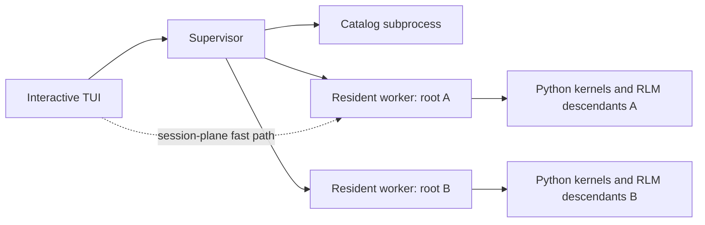

# Prime Agent one-root daemon isolation findings

**Date:** 2026-09-01
**Status:** Read-only architecture report; parked on the fallback worktree
**Prime source:** `origin/main` at `252851a26ab55be3a619c41b9325138eec5192e4` (`v0.9.1`)
**AIMgr source:** `origin/main` at `19046783f782c18be8d4d81e9229541274aab5af`

## Answer

Yes. AIMgr can give every durable Prime root its own private supervisor by assigning a short, stable `--daemon-socket` and reusing it whenever that root is resumed or attached.

That produces practical one-root/one-server isolation now:

```text
AIMgr instance A -> socket A -> supervisor A -> root worker A -> kernels and RLM children A
AIMgr instance B -> socket B -> supervisor B -> root worker B -> kernels and RLM children B
AIMgr instance C -> socket C -> supervisor C -> root worker C -> kernels and RLM children C
```

It is not literally one client process plus one server process. A persistent private Prime cell normally contains the TUI client, a supervisor, a catalog subprocess, one root worker, and any Python kernels or RLM child processes. Prime also does not enforce a one-client limit. AIMgr can enforce one root per private socket as product policy, while still allowing a deliberate second TUI to reattach to that same root.

The recommended design is:

1. One stable socket per **logical root agent tree**, not per temporary TUI process.
2. One stable session directory per private root, so its agents view does not show the global saved-session pile.
3. The existing shared `PRIME_AGENT_CODING_AGENT_DIR`, so AIMgr-managed auth, settings, extensions, MCP configuration, and kernel assets keep working.
4. An AIMgr-owned non-secret registry mapping Prime session identity to socket and session directory.
5. Explicit, exact-socket lifecycle commands; never use fleet-wide `prime-agent shutdown` to stop one cell.

This is the best fit for the requested behavior because it preserves detached work, heartbeats, schedules, subagents, Python state, and resume while removing unrelated roots from the same supervisor recovery domain.

## Recommended choice

| Mode | Available now | Cross-root control-plane isolation | Work survives TUI exit | Main cost |
|---|---:|---:|---:|---|
| Current shared default | Yes | No | Yes | One bad recovery/adoption set affects every client on the socket |
| **Private persistent cell** | **Yes, with AIMgr changes** | **Yes** | **Yes** | One supervisor and catalog per private root |
| Private foreground cell | Mostly; needs exact cleanup policy | Yes | No | Exiting the TUI stops background work by design |
| True in-process `--standalone` | Internal seam exists; public mode does not | Yes | No | Requires a Prime CLI change and loses daemon services |

**Recommendation:** implement the private persistent cell first. Add an explicit foreground policy only for disposable sessions. A true no-daemon mode is useful later, but it conflicts with the current requirement that Prime work continue after the terminal disconnects.

## What the Prime developers built

Prime is already less monolithic than it looks from the outside.



The ownership split is intentional:

| Owner | Responsibilities |
|---|---|
| TUI/client | Rendering, keyboard input, local UI preferences, attach/reconnect behavior |
| Supervisor | Public socket, client attachments, discovery, routing, worker health, recovery, global agent messages, command journals, coordinated updates |
| Catalog subprocess | Saved-session scans and inactive-session file operations |
| Root worker | One root runtime, model/provider calls, tools, scheduler, transcript, kernels, and all RLM descendants |

Normal interactive roots are **resident**. Closing the TUI detaches it but does not stop its worker. A resident worker watches its exact supervisor socket and can participate in launching a replacement supervisor if that socket disappears. This is why killing only a supervisor is not a valid teardown procedure: its workers can bring it back.

Current `origin/main` also contains direct TUI-to-worker session transport. After attach, compatible session-plane commands can bypass the supervisor; control-plane work still uses it. This reduces steady-state supervisor traffic, but it does not remove supervisor startup, adoption, roster, update, and recovery coupling.

Primary source evidence:

- `origin/main:packages/coding-agent/docs/daemon.md:3-41`
- `origin/main:packages/coding-agent/docs/architecture.md:3-49`
- `origin/main:packages/coding-agent/docs/agent-connection.md:3-68`
- `origin/main:packages/coding-agent/src/modes/daemon/daemon-routed-client.ts:39-43,128-175,210-250`

## Why the current shared daemon causes the observed startup failure

The default socket is derived from the OS temporary directory and user ID. It is not derived from the Prime config directory, project, Herdr space, AIMgr account, or root session. Ordinary clients therefore converge on one socket unless they explicitly pass `--daemon-socket`.

During replacement-supervisor startup, Prime does this:

1. Acquires the socket authority and starts listening.
2. Loads every worker descriptor associated with that socket.
3. Starts the catalog and seeds the roster.
4. Adopts or recovers the complete worker set.
5. Sends `daemon_hello` only after the startup gate is ready.

This creates the exact failure seen in the terminal: the socket can accept a connection while the supervisor deliberately withholds the ready handshake.

### Live proof from this machine

The instrumented default-supervisor log recorded one startup at 2026-09-01 17:18 CDT:

| Event | UTC timestamp | Elapsed |
|---|---:|---:|
| Startup began | 22:18:30.209 | 0 ms |
| Loaded descriptors | 22:18:31.933 | 1,728 ms; 14 workers |
| Began worker adoption | 22:18:32.221 | 2,016 ms; concurrency 8 |
| Finished worker adoption | 22:19:40.149 | 69,941 ms |
| Supervisor became ready | 22:19:41.166 | 70,950 ms |

The same trace says the supervisor accepted 18 clients before readiness and released the first waiting hello after 69,075 ms. Canonical `origin/main` waits only 30,000 ms before emitting the reported error. Therefore the observed error is not hypothetical and not primarily an Anthropic provider failure: this specific startup exceeded the client timeout while adopting unrelated resident roots.

Evidence:

- [Default daemon log: startup begin](/Users/aelaguiz/.prime/agent/logs/daemon.sock.a9cccd67.log:6603)
- [Default daemon log: 14 descriptors loaded](/Users/aelaguiz/.prime/agent/logs/daemon.sock.a9cccd67.log:6607)
- [Default daemon log: adoption started](/Users/aelaguiz/.prime/agent/logs/daemon.sock.a9cccd67.log:6612)
- [Default daemon log: adoption finished](/Users/aelaguiz/.prime/agent/logs/daemon.sock.a9cccd67.log:6645)
- [Default daemon log: ready at 70.95 seconds](/Users/aelaguiz/.prime/agent/logs/daemon.sock.a9cccd67.log:6646)

Prime's own verified incident report documents the same architectural failure domain: one unresponsive worker can take down the shared supervisor, and replacement pressure scales with the resident-worker count. See `origin/main:docs/bugs/daemon-worker-timeout-recovery-storm.md:13-15,40-61`.

### Dirty-worktree caveat

The Prime checkout is currently dirty in the daemon/recovery files. Canonical `HEAD` and `origin/main` still set the startup timeout to 30 seconds. The local uncommitted work raises it to 120 seconds and adds the trace used above, among other diagnostics.

The 120-second change would have allowed this 70.95-second startup to finish. It does not remove the coupling that caused the delay. This report therefore uses `git show origin/main:<path>` for product-architecture conclusions and treats the dirty trace only as live diagnostic evidence.

No existing Prime edit was changed or incorporated into this report.

## Why a custom socket is a real isolation boundary

`--daemon-socket <path>` is a documented top-level Prime run option, not a test-only environment hack:

- It is parsed at `origin/main:packages/coding-agent/src/cli/args.ts:103-110`.
- It is shown in public help at `origin/main:packages/coding-agent/src/cli/command-registry.ts:203-213`.
- Interactive startup creates or reuses a supervisor at that exact path in `origin/main:packages/coding-agent/src/main.ts:1217-1263`.
- The detached supervisor is launched with that path in `origin/main:packages/coding-agent/src/cli/daemon-launch.ts:386-458`.
- Explicit resume disables cross-daemon widening in `origin/main:packages/coding-agent/src/main.ts:1275-1285`.

Worker authority is namespaced by a SHA-256-derived key of the normalized supervisor socket. Prime uses that key for the worker descriptor directory and worker socket names. Two different supervisor sockets therefore get different worker inventories, recovery journals, command journals, snapshot caches, and adoption sets. See `origin/main:packages/coding-agent/src/modes/daemon/daemon-worker-cleanup.ts:215-249`.

Prime's cross-daemon attach fix explicitly preserves exact behavior for a caller-supplied socket. Multiple daemons are a supported topology; an explicit socket is deliberately not widened into discovery. See `origin/main:docs/bugs/cross-daemon-attach-routing.md:23-27,64-70`.

## What a private socket fixes

| Behavior | Shared default | Stable private socket per root |
|---|---|---|
| Supervisor startup/adoption | Includes every resident root on the default socket | Includes only the private cell's root |
| Worker descriptor/recovery authority | Shared namespace | Socket-hash-specific namespace |
| Supervisor crash/restart | Every attached client can feel it | Only that private cell feels it |
| Shutdown/update when exactly addressed | Affects every root on that supervisor | Bounded to the private supervisor |
| Session-plane execution | Already per-worker/direct when possible | Remains per-worker/direct |

A new private socket starts with no unrelated worker descriptors. It therefore avoids replaying the 14-root adoption event that produced the measured timeout.

## What a private socket does not fix

| Concern | Result |
|---|---|
| Anthropic `Connection error` inside one root's provider stream | Not fixed; provider/network errors remain inside that root worker |
| Giant saved-session list | Not fixed by socket alone; the catalog still scans the configured session directory |
| CPU/RAM pressure from many model workers and kernels | Not fixed; workers remain separate resource consumers |
| Shared OS-user permissions | Not a security sandbox; every process still runs as the same user |
| Global Prime commands | `status`, `doctor`, and especially `shutdown` still discover multiple daemons unless carefully scoped |

The socket boundary is process/control-plane isolation, not credential or security isolation.

## Why the session directory should also be private

At the investigation snapshot, the normal Prime session directory contained 118 root JSONL files. That directly explains why the agents view can show weeks of retained sessions even after worker cleanup. Saved history and live workers are separate things.

A unique socket with the default shared session directory still gives each supervisor's catalog access to the same 118 saved roots. Pairing the socket with a stable per-instance `--session-dir` gives each private cell a small catalog and a clean agents view.

Use this split:

```text
shared ~/.prime/agent
  auth.json, settings, extensions, MCP config, logs, kernel assets

private ~/.prime/agent/aimgr-instances/<instance-id>/sessions
  the root's session JSONL and session artifacts

private $TMPDIR/prime-agent-<uid>/aim-<short-id>.sock
  the root's supervisor control plane
```

Do **not** use a different `PRIME_AGENT_CODING_AGENT_DIR` for each root in the first version. AIMgr currently owns one Prime auth projection in that directory. Full agent-directory isolation would duplicate or lose settings, extensions, MCP configuration, auth descriptors, logs, and cached runtime resources. Socket plus session-directory isolation is the smallest boundary that addresses both interference and history clutter.

Source evidence:

- Prime session/socket selection: `origin/main:packages/coding-agent/src/main.ts:1254-1263`
- Prime default socket: `origin/main:packages/coding-agent/src/modes/daemon/daemon-socket.ts:100-103,316-319`
- AIMgr managed agent directory: `src/targets/prime-agent.js:6-20`
- AIMgr session-directory resolution: `src/targets/prime-sessions.js:9-16`

## AIMgr changes required

AIMgr can own this feature. It does not currently expose the Prime isolation arguments:

- `src/cli/commands/harness-target.js:517-530` rejects resume passthrough and launches only `--resume <selector>`.
- `src/cli/commands/harness-target.js:562-597` rejects run passthrough and launches only provider/model.
- `src/cli/args.js:340-357` recognizes Prime's `--rotate` but rejects other Prime options.
- `test/pi/prime-target.test.js:796-859` locks the current provider/model-only launch contract.

The product-level implementation should add a first-class AIMgr policy instead of raw arbitrary passthrough. The policy has to control identity and lifecycle consistently across run, resume, rotation, scheduled routines, status, and stop.

### Proposed instance registry

Store a non-secret registry under AIMgr's existing local state ownership, for example `targets.primeAgent.instances` in `~/.aimgr/local-state.json`:

```json
{
  "instanceId": "6d0135f4c812",
  "lifecycle": "persistent",
  "socketPath": "/var/folders/.../T/prime-agent-501/aim-6d0135f4c812.sock",
  "sessionDir": "/Users/aelaguiz/.prime/agent/aimgr-instances/6d0135f4c812/sessions",
  "sessionId": "<prime-session-uuid>",
  "sessionPath": "<absolute-jsonl-path>",
  "cwd": "<root-working-directory>",
  "provider": "anthropic",
  "model": "claude-fable-5-1",
  "createdAt": "<timestamp>",
  "lastAttachedAt": "<timestamp>"
}
```

The actual registry should also retain the non-secret binding fingerprint and Prime build identity needed for safe resume/upgrade diagnostics. Paths should be canonicalized before comparison. Writes should use the existing owner-only atomic JSON helpers.

### New-root lifecycle

1. AIMgr creates a short random instance ID, short socket path, private session directory, and a `starting` registry record.
2. It performs the existing account selection and launches Prime with `--daemon-socket`, `--session-dir`, provider, and model.
3. The inherited-TTY TUI runs normally; its worker remains resident on that private supervisor after detach.
4. AIMgr resolves the root session from the private directory or exact-socket list and commits the session ID/path into the registry.
5. A failed launch remains a diagnosable `starting`/`failed` record rather than becoming an untracked socket.

Recommended launch shape:

```bash
prime-agent \
  --daemon-socket "$SHORT_SOCKET" \
  --session-dir "$PRIVATE_SESSION_DIR" \
  --provider anthropic \
  --model claude-fable-5-1
```

### Resume and rotation lifecycle

1. Resolve the user selector through the AIMgr instance registry before falling back to legacy global-session lookup.
2. For a mapped root, pass the recorded socket, private session directory, and absolute JSONL path on every resume.
3. For `--rotate`, send the private AIM handoff command to the same exact socket before reattaching.
4. If the selector belongs to a live legacy shared worker, keep today's shared attach behavior; do not invent a random private socket.
5. Refuse a stale or contradictory mapping with the exact socket/session/lease evidence instead of silently creating a duplicate cell.

Recommended resume shape:

```bash
prime-agent \
  --daemon-socket "$RECORDED_SOCKET" \
  --session-dir "$RECORDED_SESSION_DIR" \
  --resume "$ABSOLUTE_SESSION_JSONL"
```

A random socket on every resume is incorrect. The old resident worker would remain on the old socket, and Prime's canonical JSONL lease would reject a second writer with `session_already_active`.

### Scheduled routines

AIMgr's routine pin path already creates a known session before launching the interactive TUI. Each new scheduled root can therefore receive its instance ID, socket, and private session directory before the pin. The routine receipt should retain that mapping, and the subsequent interactive resume must pass the same socket.

Prime-internal schedules and heartbeats remain owned by the root worker and survive TUI detach in persistent mode. External AIMgr/launchd routine firing is a separate lifecycle and should not be conflated with Prime's per-session scheduler.

### Account-selection race

Private sockets isolate runtime state, but AIMgr currently selects an account by updating one shared Prime auth descriptor immediately before launch. Two simultaneous `aim prime run` operations could select different accounts and race before each root captures its intended binding.

The isolation feature should serialize only the bounded account-selection-plus-root-binding admission section. Release that lock once the new root's session header/binding fingerprint is proven. Do not serialize the full lifetime of the TUI or worker.

## Exact stop and cleanup behavior

This is the main lifecycle sharp edge, but it does not block creating private persistent cells.

Public `prime-agent shutdown` means **stop every discovered agent and background service**. It calls fleet-wide `runShutdownAll` and accepts only `--force` and `--json`. AIMgr must never use it to stop one private instance.

Prime already has the exact-socket ingredients:

- The protocol accepts a `shutdown` command for one connected supervisor.
- The internal removed daemon command parses `--daemon-socket` and sends that command.
- `DaemonClient` is exported from the Prime package surface.
- Public `stop <agent> --daemon-socket <path>` can target the root worker before the empty supervisor is retired.

The clean product fix is a small supported Prime surface:

```bash
prime-agent shutdown --daemon-socket "$RECORDED_SOCKET"
```

It must validate exact socket/process identity and affect only that supervisor. AIMgr could instead call the exported exact-socket client API, but a public supported command is easier to test, diagnose, and preserve across package upgrades.

AIMgr should expose two instance policies:

| Policy | TUI exit | Background work | Stop behavior |
|---|---|---|---|
| `persistent` | Detach only | Continues | Explicit `aim prime stop <instance>` checks state, stops root, then exact-shuts the empty supervisor |
| `foreground` | Request cell shutdown | Ends | Exact shutdown only after confirming or explicitly forcing interruption of children, schedules, heartbeats, and active turns |

Never send a raw signal only to the supervisor. A resident worker watches its socket and may launch a replacement supervisor.

## True no-daemon mode

Prime has the internal architecture for an in-process interactive mode but does not expose it as a normal public persisted-session flag.

`InProcessAgentConnection` already wraps `AgentSessionRuntime`, and `main.ts` already constructs that path for explicit fallbacks, SDK cases, process-local extension factories, and the internal owned-worker frontend. The startup composition root can therefore support a public `--standalone` or `--no-daemon` flag without changing the daemon wire protocol.

The smallest Prime change would:

1. Parse and document `--standalone` in `args.ts` and `command-registry.ts`.
2. Make early startup skip daemon creation for that flag.
3. Make `shouldUseDaemonClientRuntime()` return false for it.
4. Reuse the existing persisted `SessionManager`, runtime, and `InProcessAgentConnection` path.
5. Add interactive routing, lease, signal, subprocess cleanup, and resume tests.

This would be a genuine client-owned process tree and would remove the supervisor/catalog overhead. It would also intentionally lose detached execution, supervisor replacement, remote attach, global agents view, cross-root messaging, and schedules/heartbeats after the TUI exits. That tradeoff makes it a useful opt-in for disposable foreground sessions, not the default for the current fleet.

## Resource and behavior tradeoffs

### Memory/process overhead

One pre-existing empty custom-socket service visible during this read-only snapshot used roughly 149 MiB RSS for its supervisor and 55 MiB RSS for its catalog subprocess: about 200 MiB of raw RSS before adding a root worker or kernel. The current busy default supervisor and catalog used roughly 351 MiB and 122 MiB respectively.

RSS double-counts shared pages and these are point-in-time observations, not capacity guarantees. They still show that one full supervisor/catalog pair per root is materially more expensive than one shared pair. A 14-root rollout needs measurement before becoming the unconditional default.

### Fleet features

Separate sockets intentionally fragment supervisor-local features:

- Cross-root global agent-message delivery does not automatically span private supervisors.
- A private agents view sees its private session directory rather than the global history.
- Global schedule aggregation becomes an AIMgr responsibility if a unified view is desired.
- Prime's public `status`, `doctor`, and `shutdown` still discover multiple services.
- Updates can leave several private supervisors on older builds until each cell is restarted.

RLM children under a root continue to work because they live inside that root worker. Provider/tool/kernel execution was already root-local and remains so.

### Unix socket paths

Use a short filename inside Prime's UID-scoped temporary socket directory, for example `aim-<12-hex>.sock`. Long workspace or home-directory socket paths risk the macOS Unix-domain socket path limit. AIMgr should create/verify the parent directory with owner-only permissions before launch.

## Existing sessions and migration

Live workers cannot be transparently moved from the default supervisor to a new socket. Their worker descriptors, recovery authority, and leases are associated with the original supervisor socket.

Use this policy:

1. New AIMgr roots use private cells immediately.
2. Existing live roots remain legacy/shared until explicitly migrated.
3. An idle persisted root can migrate only after its old worker is cleanly stopped and its session lease is released.
4. Migration resumes the same JSONL on a new recorded private socket/session namespace; it does not copy or rewrite transcript content.
5. Never bulk-migrate active roots automatically.

This migration involves interruption and should require explicit authorization when implementation begins. No migration was performed for this report.

## Recommended rollout

1. **Opt-in lane, 1–2 engineering days:** add `aim prime run ... --isolated`, the instance registry, private socket/session directory, exact resume, rotation routing, and focused tests.
2. **Safe lifecycle, 2–4 engineering hours plus tests:** expose exact-socket Prime shutdown or use the exported client API; add `aim prime instances`, exact status, and exact stop.
3. **Routine integration, 4–8 engineering hours:** record a private instance per scheduled root and pass its socket through pin, interactive resume, receipt, and follow-up flows.
4. **Soak, 3–7 calendar days:** measure RSS, file descriptors, startup latency, version upgrades, crash recovery, and account-binding concurrency with several private roots.
5. **Default switch, 2–4 engineering hours:** make isolation the AIMgr default, keep `--shared` for legacy compatibility, and leave existing live shared roots unmigrated.

The basic isolation path does **not** require waiting for a broad Prime rewrite. The scoped shutdown command is a small lifecycle improvement, not a reason to keep all new roots on the shared daemon.

## Suggested code surface

| Repository | Files/areas | Change |
|---|---|---|
| AIMgr | `src/cli/args.js`, `src/cli/help.js` | First-class `--isolated`/`--shared` and instance commands |
| AIMgr | `src/cli/commands/harness-target.js` | Generate/reuse mapping; pass exact socket/session dir on run, resume, and rotation |
| AIMgr | `src/targets/prime-sessions.js`, `src/state/local-state.js`, `src/io/paths.js` | Registry resolution, shape, owner-only paths, legacy fallback |
| AIMgr | `src/routines/run.js` | Give every scheduled root a stable private instance and receipt mapping |
| Prime | `public-command.ts`, `command-registry.ts`, shutdown tests | Supported exact-socket shutdown; optional later `--standalone` lane |

Existing tests that lock the current exact argv in `test/pi/prime-target.test.js` will need explicit private and legacy/shared cases. Process tests should prove two simultaneous private roots cannot see, stop, adopt, or resume each other's worker inventory.

## Current machine snapshot

This snapshot is diagnostic only; it will naturally change as sessions start and stop.

| Observation | Value during investigation |
|---|---:|
| Default supervisor socket | `/var/folders/.../T/prime-agent-501/daemon.sock` |
| Default worker descriptors | 14 at measured startup; 13 at later snapshot |
| Historical socket-hash worker namespaces | 41 directories |
| Saved root session JSONLs in default session directory | 118 files |
| Listening supervisors observed | Default socket plus one pre-existing custom isolated-test socket |

No daemon, client, worker, session, socket, descriptor, cron, Herdr pane, or authentication record was started, stopped, edited, or deleted during this investigation.

## Evidence index

### Prime source (`origin/main`)

| Claim | Source |
|---|---|
| Normal topology and resident/client-owned lifecycles | `packages/coding-agent/docs/daemon.md:3-74` |
| Client/supervisor/worker responsibility split | `packages/coding-agent/docs/architecture.md:3-49` |
| Daemon and in-process connection adapters | `packages/coding-agent/docs/agent-connection.md:3-68,140-150` |
| Public socket and session-dir parsing | `packages/coding-agent/src/cli/args.ts:103-110,145-155` |
| Explicit socket selection and exact resume | `packages/coding-agent/src/main.ts:1217-1285` |
| Resident versus client-owned create lifecycle | `packages/coding-agent/src/main.ts:1029-1099,1558-1568` |
| Socket-hash worker namespace | `packages/coding-agent/src/modes/daemon/daemon-worker-cleanup.ts:215-249` |
| Default per-UID socket | `packages/coding-agent/src/modes/daemon/daemon-socket.ts:100-103,316-319` |
| Fleet-wide public shutdown | `packages/coding-agent/src/cli/public-command.ts:276-280`; `daemon-ps.ts:790-872` |
| Exact connected-supervisor shutdown primitive | `packages/coding-agent/src/cli/daemon-command.ts:109-116,252-270` |
| Direct session-plane transport | `packages/coding-agent/src/modes/daemon/daemon-routed-client.ts:39-43,128-175,210-250` |
| Shared recovery incident | `docs/bugs/daemon-worker-timeout-recovery-storm.md:13-15,40-61` |
| Multiple-daemon exact-socket behavior | `docs/bugs/cross-daemon-attach-routing.md:23-27,64-70` |

### AIMgr source (`origin/main`)

| Claim | Source |
|---|---|
| Prime launcher uses inherited environment/argv | `src/cli/commands/harness-target.js:422-457` |
| Resume rejects passthrough | `src/cli/commands/harness-target.js:517-560` |
| Run rejects passthrough | `src/cli/commands/harness-target.js:562-597` |
| Prime CLI parser only handles rotate specially | `src/cli/args.js:340-357` |
| One AIMgr-owned Prime auth directory | `src/targets/prime-agent.js:6-20` |
| Session-dir override support | `src/targets/prime-sessions.js:9-16` |
| Local state path and shape | `src/state/local-state.js:10-69,87-97`; `src/io/paths.js:58-72` |
| Scheduled interactive Prime resume | `src/routines/run.js:799-920` |
| Existing exact launch test | `test/pi/prime-target.test.js:796-859` |

## Final verdict

Prime's shared supervisor is a deliberate persistence and fleet-control design, but it is not mandatory topology. The developers already provided the exact custom-socket seam required to split the fleet into independent control-plane cells.

The fastest sound answer is **AIMgr-managed private persistent cells: one stable socket plus one stable session directory per root, with the normal shared agent directory retained**. This removes unrelated worker adoption and saved-history clutter from each root while preserving detached agents, schedules, heartbeats, Python state, and resume.

If the requirement changes to “the process must end when the TUI ends,” add a separate foreground/standalone policy. It cannot simultaneously preserve background Prime behavior, because some process must own that work after the client exits.
